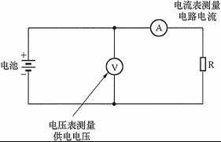
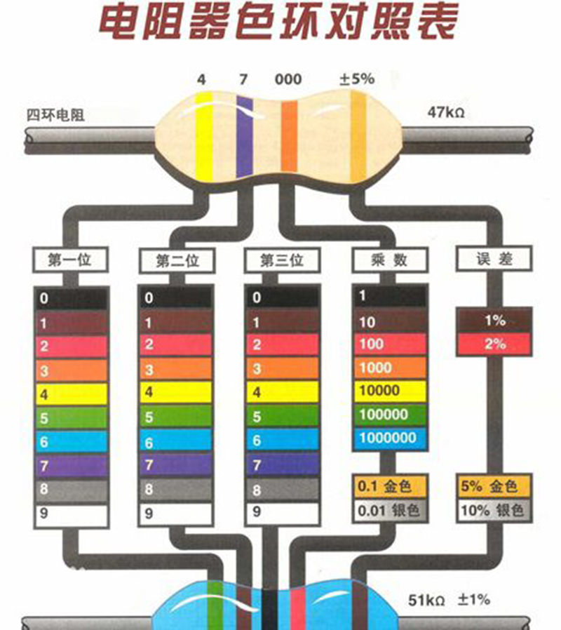

# 电路基础知识

## 电流
---
金属里面有大量自由电子，它们可以自由移动。平时金属内自由电子运动的方向杂乱无章，但是接上电池后，它们就受到了推动力，就会做定向移动，电荷的定向移动形成电流（electric current）。

### 电流的强弱
表示电流强弱的物理量是电流（electric current），通常用字母***I***表示，它的单位是**安培（ampere）**，简称**安**，符号是**A**。
有些设备中电流很小，这时我们常使用比安培小的单位毫安（mA）微安（μA）。

### 电流的测量
电荷的定向移动形成电流。规定正电荷定向移动的方向为电流的方向。电流是表示电流强弱的物理量。电流的测量应该使用电流表。电流表应该与被测量用电器串联，使电流从正接线柱流入，从负接线柱流出；被测量电流不得超过电流表的最大测量值（量程）。

### LED发光二极管
利用发光二极管可以判断电流的方向。发光二极管是一种电子元件，简称LED。它的两根引脚中较长的为正极，较短的为负极。当电流由正极经过LED流向负极时，LED发光，表明它正处于导通状态；反之，

## 电路
---
物理学中将电池这类提供电能的装置叫做电源（power supply），将灯泡、电动机、蜂鸣器等这类消耗电能的装置叫做用电器。电源、用电器以及导线，还有开关，组成了电流可以流过的路径——电路（electric circuit）。**注意：只有电路闭合时， 电路中才有电流。**

### 电路图
用符号表示电路连接的图，叫做电路图。

### 通路 断路 短路
- 通路：正常接通的电路，即用电器能够工作的电路叫做通路。
- 断路：电路中如果某处被切断，电路中就不会有电流流过，这种情况叫做断路。
- 短路：直接用导线将电源的正、负极连接起来，这种情况叫做短路。

### 串联和并联

- 串联：如下图，两个小灯泡依次相连，然后接到电路中，我们说这两个小灯泡是串联（series connection）的。

- 并联：如下图，两个小灯泡的两端分别连在一起，然后接到电路中，我们说这两个小灯泡是并联（parallel connection）。

- 串联电路的电流规律：串联电路中的电流处处相等。

- 并联电路的电流规律：并联电干路中的电流等于各支路中的电流只和。

## 电压 ##
---
- 电压（英语：Voltage，electric tension或 electric pressure），也称作电势差（electrical potential difference），是衡量单位电荷在静电场中由于电势不同所产生的能量差的物理量。此概念与水位高低所造成的“水压”相似。需要指出的是，“电压”一词一般只用于电路当中，“电动势”和“电位差”则普遍应用于一切电现象当中。

### 串、并联电路中电压的规律

- 串联电路中电源两端电压等于各用电器两端电压之和，用符号表示时可以写为
  U=U1+U2

- 并联电路中电源两端电压与各支路用电器两端的电压相等，用符号表示时可以写为
  U=U1-U2

## 电阻 ##
---

- 在物理学中，用电阻来表示导体对电流阻碍作用的大小。导体的电阻越大，表示导体对电流的阻碍作用越大。导体的电阻通常用字母R表示，单位是欧姆（ohm），简称欧，符号是Ω。比较大的单位有千欧（KΩ）、兆欧(MΩ），它们的换算关系是
1KΩ=1000Ω
1MΩ-1000000Ω
在电子技术中，我们经常要用到具有一定电阻值得元件——电阻器。

## 变阻器的应用 ##
- 变阻器通常标有最大电阻和允许通过的最大电流，使用时要根据需要进行选择，不能使通过的电流超过最大值，否则会烧坏变阻器。通常在使用前应将电阻器调节到最大。在电路中，变阻器的作用主要是通过调节其电阻值，改变电路中的电流。

## 欧姆定律 ##
---
导体中的电流，跟导体两端的电压成正比，跟导体的电阻成反比。如果用U表示导体两端的电压，R表示导体的电阻，I表示导体中的电流，那么用公式表示就是

    U=IR
其中U的单位为伏特（V），R的单位为欧姆（Ω），I的单位为安培（A）

## 色环电阻识别方法 ##
- 色环电阻识别方法是指电阻上面用了四道色环或者五道色环或者六道色环来表示电阻值 。可以从任意角度一次性的读取代表电阻值的颜色信息。
色环电阻是应用于各种电子设备的最多的电阻类型，无论怎样安装，维修者都能方便的读出其阻值，便于检测和更换。

### 识别方法 ###
- 四个色环电阻的识别：第一、二环分别代表两位有效数的阻值；第三环代表倍率；第四环代表误差。
- 例子：
- 棕 红 红 金
- 其阻值为12×10^2=1.2kΩ 误差为±5%
- 误差表示电阻数值，在标准值1200上下波动（5%×1200）都表示此电阻是可以接受的，即在1140-1260之间都是好的电阻。
带有四个色环的其中第一、二环分别代表阻值的前两位数；第三环代表倍率；第四环代表误差。快速识别的关键在于根据第三环的颜色把阻值确定在某一数量级范围内，例如是几点几K、还是几十几K的，再将前两环读出的数"代"进去，这样就可很快读出数来。

