# 如何适配HiveMQ平台

HiveMQ 是一个 MQTT 代理和基于客户端的消息传递平台，旨在快速、高效和可靠地将数据移入和移出连接的物联网设备。

平台链接：[https://www.hivemq.com/](https://www.hivemq.com/)

## 平台账号注册

进入HiveMQ官网，点击在右上角的菜单栏上的Cloud

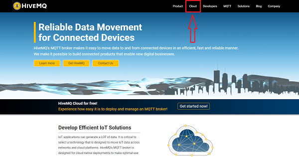

在弹出页面点击选择sign up now

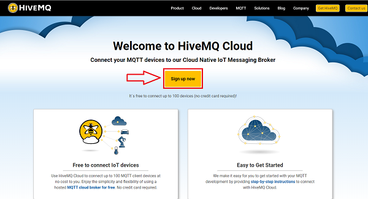

在弹出页面点击选择sign，输入注册信息（邮箱、密码）,然后点击SIGN UP.

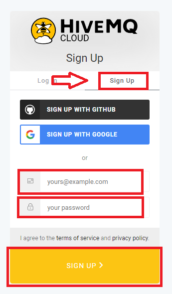
这里需要注意密码输入要求

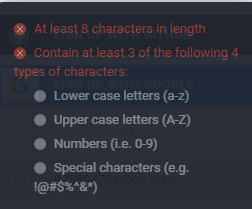
然后根据平台注册引导注册账号。

## 平台使用操作指南

注册成功后，输入网址：https://www.hivemq.com/mqtt-cloud-broker/
在弹出页面点击选择sign up now

输入你注册的邮箱以及密码，点击LOG IN登录.

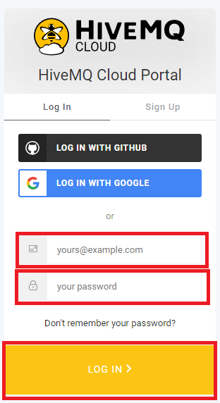

点击左下角CREATE CLUSTER.

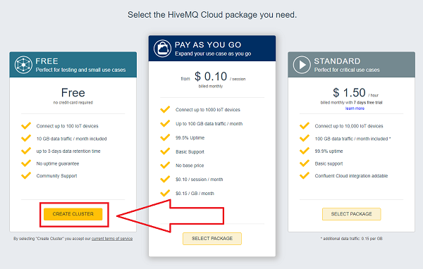

选择Azure，并点击CREATE CLUSTER。

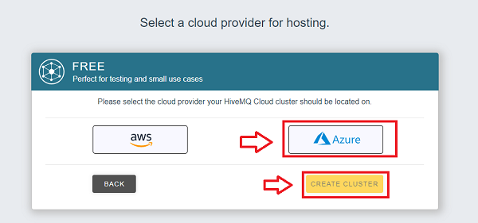

点击MANAGE CLUSTER

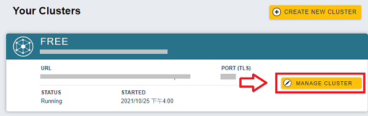

点击Access Management，设置Username，Passwoed，并点击ADD。（添加用户账号）

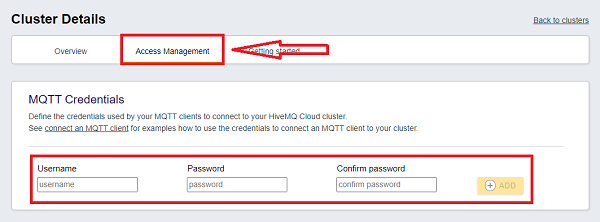

添加成功，请记住这个Username，以及Password，这个信息将在makecode端设置MQTT配置的使用。

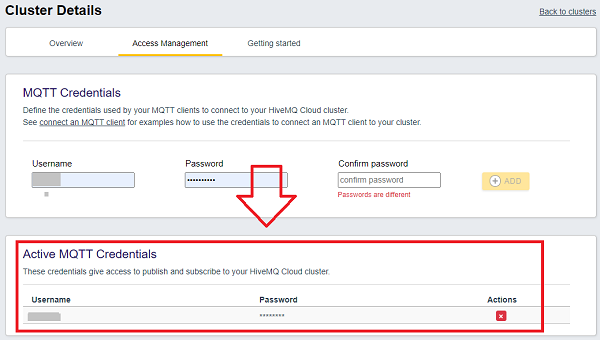

硬件连接部分请参考wiki：[https://www.elecfreaks.com/learn-en/microbitKit/iot_kit/iot_bit.html](https://www.elecfreaks.com/learn-en/microbitKit/iot_kit/iot_bit.html)

**注意：**请务必使用IOT:bit上的USB接口进行供电，否则wifi模块不供电。

打开makecode编程平台：[https://makecode.microbit.org/#editor](https://makecode.microbit.org/#editor)

点击“Advanced”，然后选择“Extensions”。

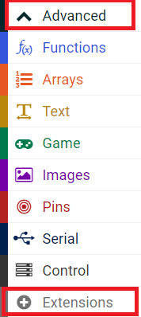

然后在弹出界面的搜索栏输入“iot-environment-kit”点击搜索，并添加软件扩展库。

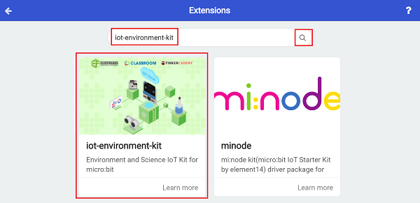

在添加成功后点击“ESP8266_IoT”。

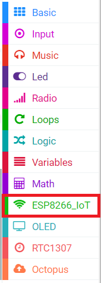

在当开机时初始化ESP8266，并输入wifi名称和wifi密码连接至wifi。

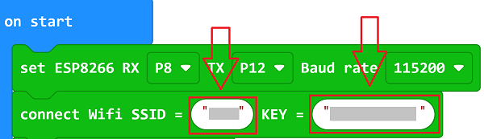

然后设置MQTT配置，scheme选择为TLS，自定义clientID，username为HiveMQ上添加的username，password为HiveMQ上设置的password。

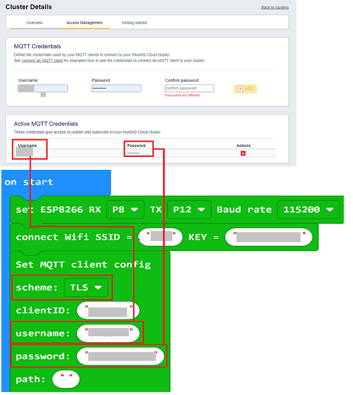
点击Overview，将HiveMQ上的Host和port复制到makecode中。

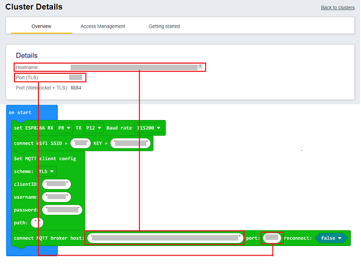

点击Getting started，选择HiveMQ Websocket Client。

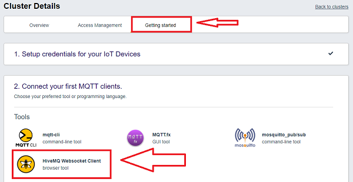

在跳转页面点击step1中的here。

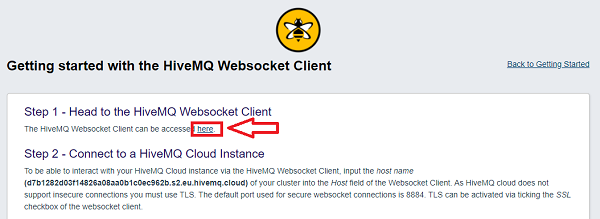

在跳转页面中输入User和Password，再点击Connect连接至MQTT集群。

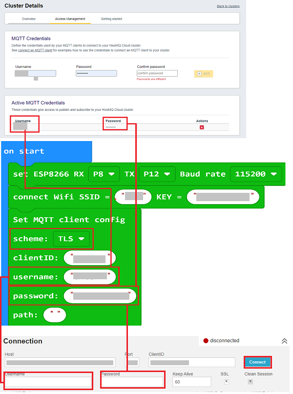

连接成功后会右上角会出现connected。

然后点击Subscriptions下的Add New Topic Subscription，添加订阅信息。

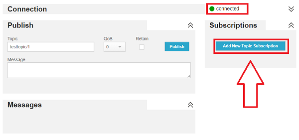

在弹出页面点击Subscribe。

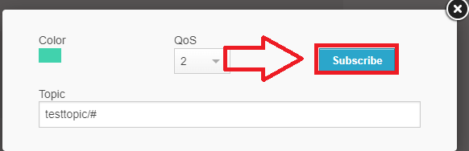

订阅信息完成后，在makecode 端即可发送信息到平台。

积木块中"hello"为将要发送的信息，可自行更改，积木块中的Topic:"testtopic/1"为平台上预设的Topic，将#改成任意数字即可。

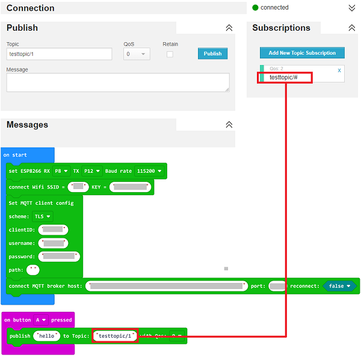

按照以上程序，按下micro:bit上的按键A即可发送“hello”至平台。

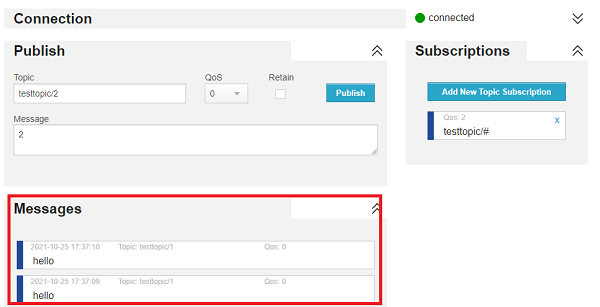

当然，我们也可以从平台上发送数据到本地，在平台上设置Topic为：testtopic/2，在Message中输入想要发送到本地的信息，然后点击Publish即可发送到本地。
同样本地接收程序积木块中也要保持Topic一致。

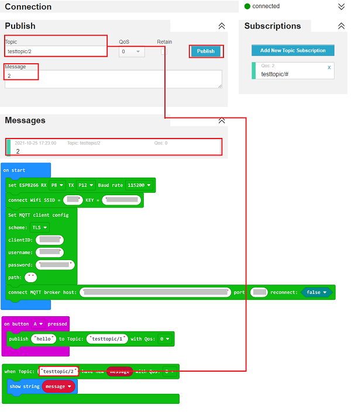

从平台发送数字2到本地，并通过micro:bit上的LED矩阵显示出来。

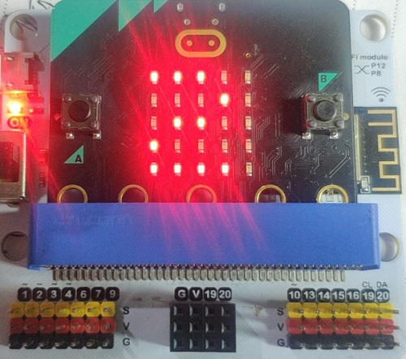

完整程序:

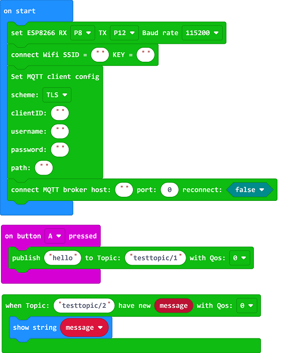

完整程序链接：[https://makecode.microbit.org/_2Ys7uE8F7Dr8](https://makecode.microbit.org/_2Ys7uE8F7Dr8)

## FAQ

### F：如何判断当前版本的IOT:bit是否支持MQTT？
Q：请查看IOT:bit背面的版本号，IOT:bit V1.6版本支持MQTT协议，IOT:bit V1.4及其以下版本不支持MQTT协议。

