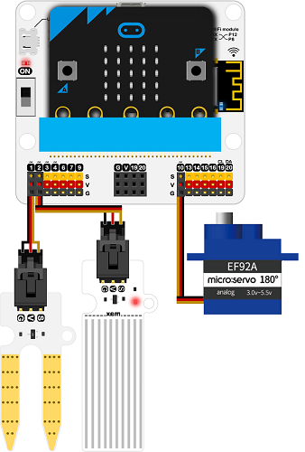
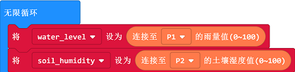
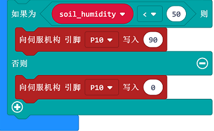

# iot套件案例04：智能灌溉控制系统

## 目的
---

- 制作一个智能灌溉控制系统。

## 使用材料
---

- 1 x [IOT:kit(物联网环境科学套件):https://www.elecfreaks.com/store](https://www.elecfreaks.com/store/micro-bit-smart-science-iot-kit-with-micro-bit.html)

## 背景知识
---

### 什么是智能灌溉控制系统
---

- 智能灌溉控制系统 是基于物联网通用平台和云计算技术，结合自动控制技术和专家系统技术、传感器技术、网络技术、无线通信技术、软件技术等于一体的智能化远程节水灌溉控制和管理系统。。
该系统可以接入大田或者温室滴灌、喷灌等各种类型的灌溉系统，可以控制水肥一体化设备。系统根据物联网系统采集到的温室或农田的土壤温湿度和空气温湿度等环境参数、当前及未来的天气状况以及作物生长实际用水需求，通过物联网平台对滴灌、喷灌、微灌、水肥一体化等灌溉设备进行智能控制，实现精准灌溉，提高水资源的利用率，为农作物生长提供更精准的生长环境，。
使用智能灌溉控制系统，不但能更有效地利用水资源、提高产量，还能够提高自动化生产效率，降低人力成本和管理成本，显著提高效益。

## 硬件连接图
---

如图所示，将土壤湿度传感器模块连接到`P1`口。

如图所示，将水位传感器模块连接到`P2`口。

180°舵机连接到`P10`口。

## 软件
---

[微软makecode](https://makecode.microbit.org/#)

## 编程
---

### 步骤 1
- 在MakeCode的代码抽屉中点击Advanced，查看更多代码选项。

- 为了给IoT物联网环境科学套件编程，我们需要添加一个扩展库。在代码抽屉底部找到“Extension”，并点击它。这时会弹出一个对话框。搜索“IOT"，然后点击下载这个代码库。

*注意：*如果你得到一个提示说一些代码库因为不兼容的原因将被删除，你可以根据提示继续操作，或者在项目菜单栏里面新建一个项目。

### 步骤 2

在`on start`中插入`servo write`积木块，参数填入`0`复位舵机到0度关闭水阀。

### 步骤 3

在`forever`中插入`set to`积木块。
读取水位值赋值给`water level`变量，读取土壤湿度值赋值给`soil humidity`变量。

### 步骤 4

之后判断水缸的水位是否低于10，如果低于10，播放`ba ding`提醒向自动灌溉水箱注水。

### 步骤 5

然后判断土壤湿度是否低于30，即是否需要浇水。

如果低于30，打开阀门浇水，如果不低于30，就关闭阀门。

### 程序

请参考程序连接：[https://makecode.microbit.org/_dxTF0K1be0w0](https://makecode.microbit.org/_dxTF0K1be0w0)

你也可以通过以下网页直接下载程序。

<iframe style="position:absolute;top:0;left:0;width:100%;height:100%;" src="https://makecode.microbit.org/#pub:_dxTF0K1be0w0" frameborder="0" sandbox="allow-popups allow-forms allow-scripts allow-same-origin"></iframe>
  

### 现象
---

## 思考
---

## 常见问题
---

## 相关阅读  
---
