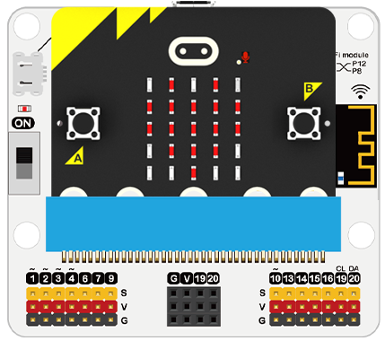

# 第一节：SmartIot平台使用手册
---
- SmartIot是恩孚科技出品的一个简单易用的物联网平台，3分钟连接物联网，实施远程操控microbit。（中/英文切换文暂时没有更新）
 平台链接：[SmartIot云平台: https://www.smartiot.cn/](https://www.smartiot.cn/)

## SmartIot 平台账号注册

- 进入SmartIot 官网，点击Sing up进入注册新账号页面

- 填好注册信息(邮箱、密码)点击Sign Up。

- 点击Sign Up注册，会发送一封邮件到你填写的账号邮箱

- 检查你的邮箱的收件箱或者垃圾箱（可能会被识别为垃圾邮件），打开邮件中的网址以激活你的账号。

- 注册成功

## SmartIot 平台使用指南

- 点击主页上的Sign in，进入登陆界面

- 点击Log in进入设备管理页面，左上角是User Name为你的邮箱，右上角User Token（现有误写为ID，后期会改为Token）是平台唯一识别码，对应你的账号。全网唯一，不会重复。

- 添加一个新的设备（Create new device），Topic是你的设备识别号（在账号中的唯一设备）可以修改设备名称（你只能拥有10个设备）
- 点击Details可以进入设备以查看信息，点击Delete以删除设备

- 设备界面里左侧为上传数据，右侧由数据和时间组成二维折线图，可以选择要显示的数据，也可以导出数据（export data）
- Remote Control可以下发指令控制microbit。

## 编写代码
---

[微软makecode](https://makecode.microbit.org/#)

### 编程
---
### 模块连接图
- 将光线传感器模块连接到P1口。

### 添加软件库
- 在MakeCode的代码抽屉中点击Advanced，查看更多代码选项。

- 为了给IOT物联网环境科学套件编程，我们需要添加一个扩展库。在代码抽屉底部找到“Extension”，并点击它。这时会弹出一个对话框。搜索“IOT"，然后点击下载这个代码库。

***注意：如果你得到一个提示说一些代码库因为不兼容的原因将被删除，你可以根据提示继续操作，或者在项目菜单栏里面新建一个项目。

### 代码解释

 
连接smart’Iot平台。User Token（暂时误写作ID）为账户唯一识别码，与账户绑定不可修改。
 

 TOPIC，设备唯一识别码，连接时需要指定上传设备。设备号（Topic）顺序排列。

- - - - -

上传一个整数到SmartIot平台，会在这里显示。

- - - - -

判断平台连接状态是否成功，成功（True），失败（False）。
可以自己编写重连机制以保证连接稳定。
- - - - -

当平台连接成功后，可以点击这个开关来执行这两个积木块。

### 参考程序

请参考程序连接：[https://makecode.microbit.org/_4opTryFiyicy](https://makecode.microbit.org/_4opTryFiyicy)

你也可以通过以下网页修改程序。

<iframe style="position:absolute;top:0;left:0;width:100%;height:100%;" src="https://makecode.microbit.org/#pub:_4opTryFiyicy" frameborder="0" sandbox="allow-popups allow-forms allow-scripts allow-same-origin"></iframe>
  

### 现象
---
当开机时连接WIFI
循环判断是否连接WIFI，如果连接显示颗大心，如果未连接就继续连接。
循环判断smartIot平台是否连接，如果连接显示一颗小心，如果未连接就继续连接。
循环判断如果SmartIot连接成功则上传一个数据“连接到P1的光线数据”到平台
如果平台开关打开播放音乐“Power Up”
如果平台开关关闭播放音调“Power Down”
