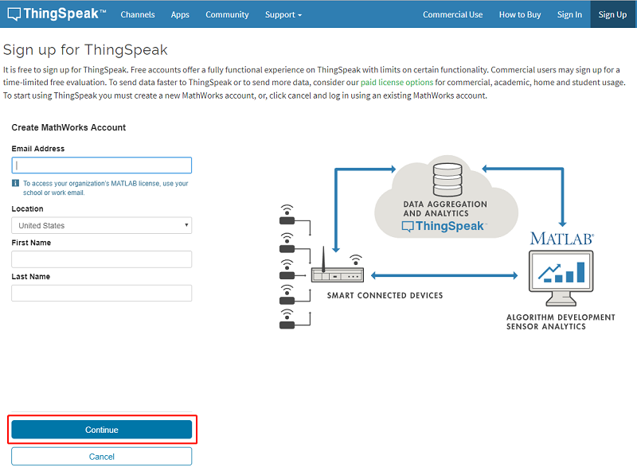
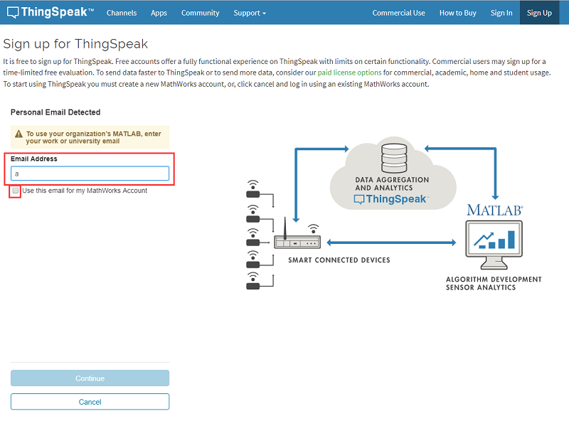
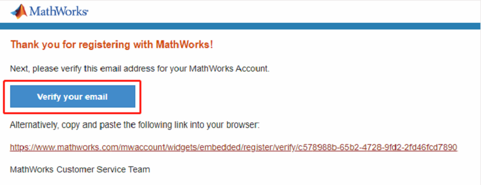

# 第一节：Thingspeak 平台
---

- ThingSpeak可以处理HTTP请求，并存储和处理数据。这个开放数据平台的主要功能包括开放应用程序、实时数据收集、地理位置数据、数据处理和可视化、设备状态信息和插件。它可以集成多个硬件和软件平台，包括Arduino、树莓派、ioBridge/RealTime.io、Electic lmp、移动和网络应用、社会网络和MATLAB数据分析。除了开源版本，还提供托管服务。

 平台链接：[thingspeak云平台: https://thingspeak.com/](https://thingspeak.com/)

## Thingspeak 平台账号注册
 

- 进入thingspeak 官网，点击Get Started For Free，或者Sing up进入注册新账号页面

- 填好注册信息(邮箱、地区、名字)，点击continue继续。

- 确认邮箱地址，勾选使用此邮箱作为登陆账号，点击继续按钮。

- 验证MathWorks账号，thinggspeak会发送邮件至你邮箱中，点击邮件内链接验证后点击continue继续

- 设置你的用户名与登录密码（注意：密码必须包含大小写字母），点击continue继续

- 注册成功

## thingspeak使用操作指南

- 我们这里上传光线强度来进行测试。

- 点击 “Channels”-“MY Channels”-“New Channel，新建一个频道。

- 出现项目参数设计列表

- 填写如下内容，如果有多个参数，就选择多个field

- 点击save channel 就可以了

- 新建的channel没有任何内容，而我们上传的数据就会在这里显示。

- 点击API KEY ，查看write key，就是我们编程时上传数据所需的地址。

## 编程

## 软件
---

[微软makecode](https://makecode.microbit.org/#)

## 编程
---

### 步骤 1
- 在MakeCode的代码抽屉中点击Advanced，查看更多代码选项。

 

- 为了给IOT物联网环境科学套件编程，我们需要添加一个扩展库。在代码抽屉底部找到“Extension”，并点击它。这时会弹出一个对话框。搜索“IOT"，然后点击下载这个代码库。

 

**注意：**如果你得到一个提示说一些代码库因为不兼容的原因将被删除，你可以根据提示继续操作，或者在项目菜单栏里面新建一个项目。

### 步骤 2

在`on start`中插入`set 8266`积木块，参数选择RX`P8`TX`P12`baud rate`115200`。

然后插入`connect wifi`积木块，填入可用的wifi名称与密码，

***注意：8266模块暂时不支持5G路由器WIFI信号，请连接2.4G路由器WIKI信号***
### 步骤 2

在`forever`中依次插入`connect thinkspeak`积木块，`set data`积木块，`send data`积木块和`pause`积木块。

其中在`set data`积木块中填入上一步获取的`write api key`在`field1`中插入`光线传感器值`积木块。

暂停`60s`，一分钟发送一次。

### 程序

请参考程序连接：[https://makecode.microbit.org/_Rfe5wJhT1f2D](https://makecode.microbit.org/_Rfe5wJhT1f2D)

你也可以通过以下网页修改程序。

<iframe style="position:absolute;top:0;left:0;width:100%;height:100%;" src="https://makecode.microbit.org/#pub:_Rfe5wJhT1f2D" frameborder="0" sandbox="allow-popups allow-forms allow-scripts allow-same-origin"></iframe>
  

### 现象
---

每隔一分钟都会向thingspeak上传一次当前光线值的数据。

thingspeak可以查看所有数据。

