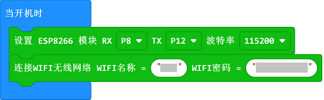

# 第二节：如何适配ThingSpeak平台
---
- ThingSpeak可以处理HTTP请求，并存储和处理数据。这个开放数据平台的主要功能包括开放应用程序、实时数据收集、地理位置数据、数据处理和可视化、设备状态信息和插件。它可以集成多个硬件和软件平台，包括Arduino、树莓派、ioBridge/RealTime.io、Electic lmp、移动和网络应用、社会网络和MATLAB数据分析。除了开源版本，还提供托管服务。

 平台链接：[thingspeak云平台: https://thingspeak.com/](https://thingspeak.com/)

## Thingspeak 平台账号注册

- 进入thingspeak 官网，点击Get Started For Free，或者Sing up进入注册新账号页面

- 填好注册信息(邮箱、地区、名字)，点击continue继续。

- 确认邮箱地址，勾选使用此邮箱作为登陆账号，点击继续按钮。

- 验证MathWorks账号，thinggspeak会发送邮件至你邮箱中，点击邮件内链接验证后点击continue继续

- 设置你的用户名与登录密码（注意：密码必须包含大小写字母），点击continue继续

- 注册成功

## thingspeak使用操作指南

- 我们这里上传光线强度来进行测试。

- 点击 “Channels”-“MY Channels”-“New Channel，新建一个频道。

- 出现项目参数设计列表

- 填写如下内容，如果有多个参数，就选择多个field

- 点击save channel 就可以了

- 新建的channel没有任何内容，而我们上传的数据就会在这里显示。

- 点击API KEY ，查看write key，就是我们编程时上传数据所需的地址。

## 软件
---

[微软makecode](https://makecode.microbit.org/#)

## 编程
---
### 模块连接图
- 将micro:bit连接到iot:bit上。

### 步骤 1
- 在MakeCode的代码抽屉中点击Advanced，查看更多代码选项。

- 为了给IOT物联网环境科学套件编程，我们需要添加一个扩展库。在代码抽屉底部找到“Extension”，并点击它。这时会弹出一个对话框。搜索“IOT"，然后点击下载这个代码库。

***注意：如果你得到一个提示说一些代码库因为不兼容的原因将被删除，你可以根据提示继续操作，或者在项目菜单栏里面新建一个项目。

### 步骤 2

在`当开机时`中插入`设置ESP8266模块`积木块，参数选择RX`P8`TX`P12`波特率`115200`。

然后插入`连接 wifi 无线网络`积木块，填入可用的wifi名称与密码，

***注意：8266模块暂时不支持5G路由器WIFI信号，请连接2.4G路由器WIKI信号***
### 步骤 3

在`无限循环`中依次插入`连接thinkspeak`积木块，`设置发送到ThingSpeak平台的数据`积木块，`上传数据到ThingSpeak平台`积木块。

其中在`设置发送到ThingSpeak平台的数据`积木块中填入上一步获取的`write api key`在`field1`中插入`随机数`积木块。

### 程序

请参考程序连接：[https://makecode.microbit.org/_3MAFcaC7DVJ8](https://makecode.microbit.org/_3MAFcaC7DVJ8)

你也可以通过以下网页修改程序。

<iframe style="position:absolute;top:0;left:0;width:100%;height:100%;" src="https://makecode.microbit.org/#pub:_3MAFcaC7DVJ8" frameborder="0" sandbox="allow-popups allow-forms allow-scripts allow-same-origin"></iframe>
  

### 现象
---

持续向thingspeak上传随机的数据。

thingspeak可以查看所有数据。

## Thingspeak 添加可视化
- - - - -
- 点击添加可视化按钮，可以选择三个可视化小器件，分别为:[码表]、[数值显示]、[阙值指示灯]。

- 选择码表类型，点击NEXT，填写图表名字(Name)，图表通道(Field1)，最小值最大值。然后点击Create新建图表。

- 图表就会和通道1(Field 1)数值同时产生变化了。

- 同理添加数值显示和阙值指示灯图表。

