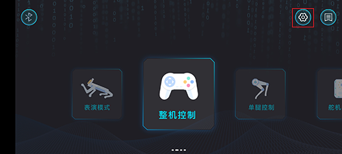
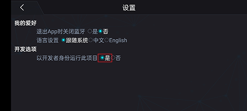
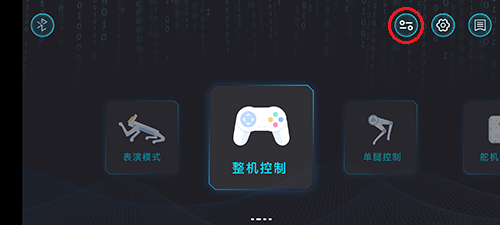
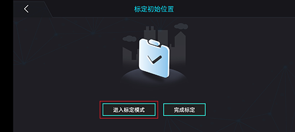
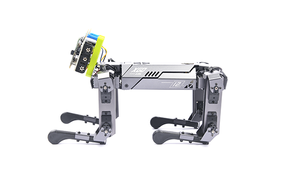
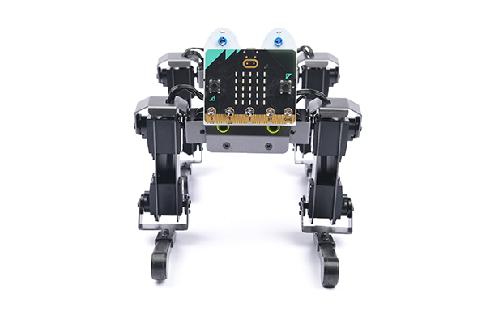
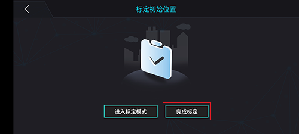
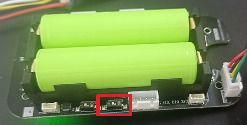

# 重新标定机器狗

哈喽，未来之星，我想你也发现了，当我们长时间使用 XGO 之后会发现 XGO 总会偏离我们给它预定的标准动作，这是因为 XGO 的舵机在长时间使用后会出现误差，这种情况下，我们就需要重新标定机器狗，也就是回复到标准状态，下面跟着我们来尝试做一下。

## 方法一，使用XGO APP软件

1、打开软件，首先通过蓝牙与机器狗相连接，然后点击右上角的齿轮进入设置页面，选择以开发者方式运行。

2、选择以开发者方式运行

3、返回主界页面，软件上方出现了新的按钮，点击进入标定界面。

4、进入标定界面，点击“进入标定模式”，此时舵机会卸载。

将机器狗摆至如下所示位置，**建议在下方垫一张平整的纸**，使机身与桌面平齐，大腿与机身呈90°夹角，小腿与大腿呈90°夹角，小腿贴地。

机器狗标定姿势

在APP中点击完成标定，机器狗会恢复到初始位置

## 方法二，使用驱动板标定拨码

首先用六角扳手将背盖拆开，然后把标定拨码拨到ON的位置，如果已经在ON的位置，那就拨回去，再拨到ON的位置。此时，此时舵机会卸载。

标定拨码

将机器狗摆至如下所示位置，**建议在下方垫一张平整的纸**，使机身与桌面平齐，大腿与机身呈90°夹角，小腿与大腿呈90°夹角，小腿贴地。

机器狗标定姿势

然后将标定拨码拨回，此时完成了标定，机器狗会恢复到初始位置。