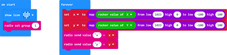
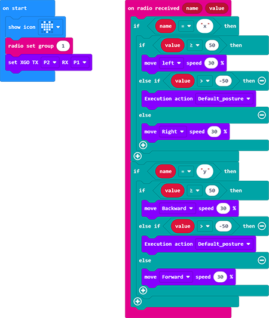

# 案例 06 - joystick:bit控制XGO

## 目的

实现joystick:bit控制XGO做出动作。关于joystick:bit的相关文档请参考：[Joystick:bit]([14. Joystick:bit V2 — micro bit tutorial (elecfreaks.com)](https://www.elecfreaks.com/learn-en/microbitExtensionModule/joystick_bit_v2.html))

## 使用材料

1 × micro:bit XGO Robot Kit 套件

1 × joystick:bit 套装

## 硬件连接

使用数据线将电脑与micro:bit 相连。

## 软件平台

[Makecode](https://makecode.microbit.org/#)

## 编程

将 XGO 的扩展库添加到 makecode 中。

## 程序

#### 示例程序

###### 给Joystick:bit编程

###### 给 XGO 编程

请参考程序链接：[Joystick程序](https://makecode.microbit.org/_gPjJh9HEUYUm)

同时，可以直接下载下方程序；

<iframe style="position:absolute;top:0;left:0;width:100%;height:100%;" src="https://makecode.microbit.org/#pub:_gPjJh9HEUYUm" frameborder="0" sandbox="allow-popups allow-forms allow-scripts allow-same-origin"></iframe>
 

请参考程序链接：[XGO程序](https://makecode.microbit.org/_LhKY78KcAFHa)

同时，可以直接下载下方程序；

<iframe style="position:absolute;top:0;left:0;width:100%;height:100%;" src="https://makecode.microbit.org/#pub:_LhKY78KcAFHa" frameborder="0" sandbox="allow-popups allow-forms allow-scripts allow-same-origin"></iframe>
 

## 相关问题

如果 XGO 没有行走，检查电源是否充足或者Joystick:bit的电量是否充足；

## 思考

能否让 XGO 根据Joystick:bit的C/D/E/F按键来做出相关动作？
