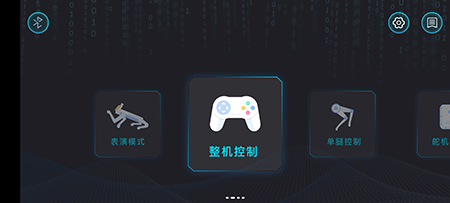
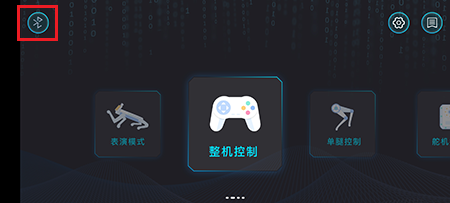
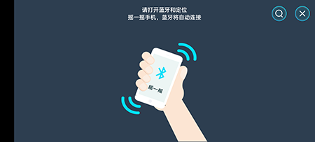
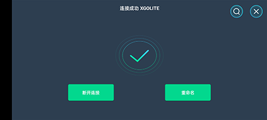
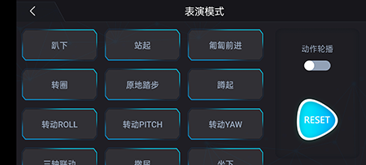
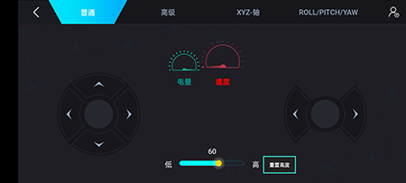
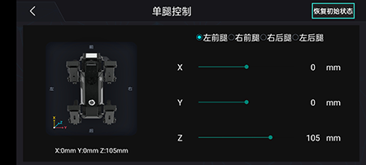
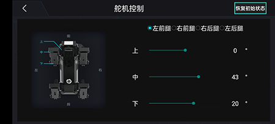

# 案例07-移动端XGO APP控制XGO

## 目的

通过移动端XGO APP控制XGO做出特定的动作。

## 使用材料
1 × micro:bit XGO Robot Kit 套件

1 × 智能手机

## 硬件连接
### 下载XGO APP

安卓用户可以在百度或者小米应用商店搜索XGO，苹果用户可以在苹果应用市场搜索XGO，下载安装后并打开，XGO app界面如图。

### 连接XGO

点击app界面左上角的蓝牙图标如图所示，会出现如图界面。

根据提示，摇一摇手机，蓝牙将自动连接。（注意：提前将xgo开机，提前打开手机蓝牙和定位，如果连接不上，查看手机设置，是否授权xgo app定位和蓝牙应用权限）连接成功结果如图所示。

## 控制
xgo app有四种方式可以控制xgo，分别是**表演模式**、**整机模式**、**单腿控制**、**舵机控制**。

**表演模式**是集成预定指令，可以让xgo做出预定好的动作，自由度低，操作性高；

**整机模式**可以自由控制xgo的速度和方向，自由度高，操作灵敏；

**单腿控制**和**舵机控制**可以控制的颗粒度更小，对单只腿（左前腿、右前腿、右后腿、左后腿）进行控制，对单只腿的上中下舵机进行调节。一般用于对特定动作的微小调节；

## 案例
这节课程使用xgo app**整机控制**模式控制xgo前后左右行走。演示视频如图所示。

