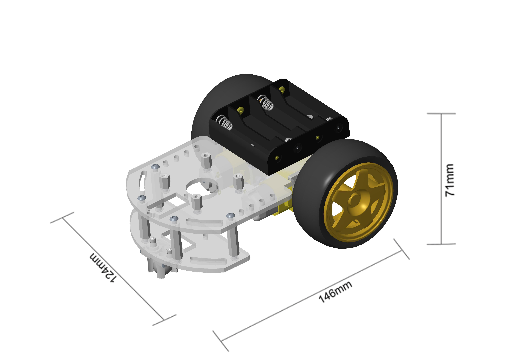
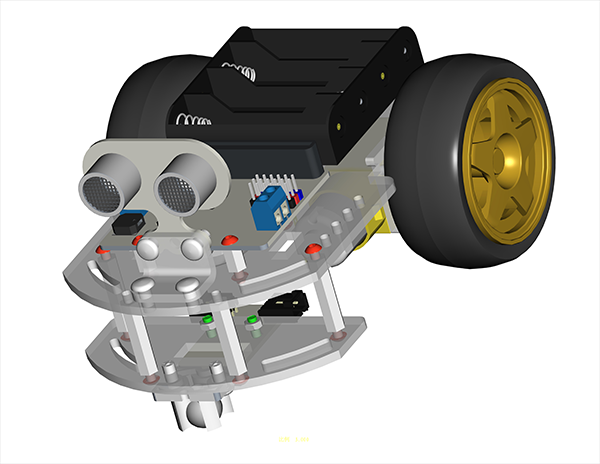

# motor:bit 智能小车简介

## 简介  
---

motor:bit亚克力智能小车是为micro:bit两路电机驱动板量身打造的一款智能小车，它包含micro:bit两路电机驱动板、3线超声波模块和两路巡线模块，可使用它DIY一款micro:bit两轮驱动智能小车。

## 特性的
---
- 体积小巧，结构紧凑
- 预留传感器安装接口

## 参数
---

### 技术参数

项目 |参数 
:-:|:-:
电机品种|TT马达
驱动轮数目|2 
电源|4节5号电池
是否支持巡线|是
是否支持超声波|是
净重|246g
组装后尺寸|146mm x 124mm x 71mm

### 组装后尺寸图

## 零件清单
---
项目 |数量 |备注
:-:|:-:|:-:
底盘包|1|-
2路电机驱动板|1|-
超声波|1|-
2路寻线模块|1|-

## 底盘安装图纸
---

### 底盘零件平铺图

### 组装爆炸图

### 成品示意图

## 文档
---

## 常见问题
---
