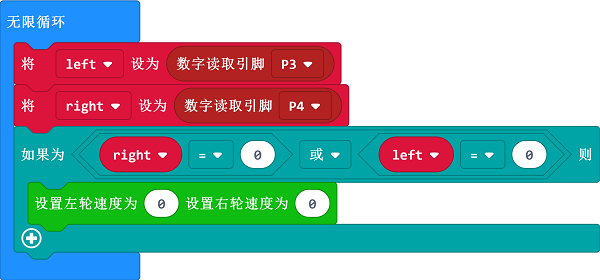

# 案例01 定点停车

## 目的
---

- 使用motor:bit智能车载套件完成定点停车功能。

## 使用材料
---

- 1 x motor:bit 智能车载套件

## 背景知识
---
### 巡迹模块原理

- 该巡迹模块使用的为[红外线传感器](https://baike.baidu.com/item/%E7%BA%A2%E5%A4%96%E7%BA%BF%E4%BC%A0%E6%84%9F%E5%99%A8/9007351?fr=aladdin),模块由一个**发射端**和一个**接收端**组成，发射端发射红外线由地面反射回来由接收端接收。
- 遇到黑色地面或者其他吸收红外光材质的物品时，接收端无法接收到红外线，巡迹模块返回1。

## 硬件连接图
---

如图所示，将巡线模块左边传感器(S1)连接到motor:bit主板的4号引脚，将右边传感器(S2)连接到motor:bit主板的3号引脚。

## 软件
---
[微软makecode](https://makecode.microbit.org/#)在线积木块编程[https://makecode.microbit.org/#](https://makecode.microbit.org/#)

## 编程
---
### 步骤 1
在MakeCode的代码抽屉中点击高级，查看更多代码选项。

为了给motorbit主板编程，我们需要添加一个代码库。在代码抽屉底部找到“扩展”，并点击它。这时会弹出一个对话框。搜索“motorbit"，然后点击下载这个代码库。

注意：如果你得到一个提示说一些代码库因为不兼容的原因将被删除，你可以根据提示继续操作，或者在项目菜单栏里面新建一个项目。

### 步骤 2

- 在`当开机时`积木块中插入 以...的速度前进 积木块，设置参数为80，表示上电时以80的速度前进。
- 设置两个变量分别为`left`和`right`，用来分别巡线模块左右传感器的返回参数，并且将他们初始化为1。

### 步骤 3

- 在`无限循环`积木块中，插入数字读取引脚 P3和P4，分别对应巡线模块的左右两个传感器。
- 并且分别赋值给`left`和`right`变量。
- 然后判断`left`变量和`right`变量是否有一个为0，也就是左右传感器其中一个检测到黑线。
- 如果有一个为0，设置左右电机速度为0，停车。

### 程序
请参考程序连接：[https://makecode.microbit.org/_1gXfr9fdA6LH](https://makecode.microbit.org/_1gXfr9fdA6LH)

你也可以通过以下网页直接下载程序。

<iframe style="position:absolute;top:0;left:0;width:100%;height:100%;" src="https://makecode.microbit.org/#pub:_1gXfr9fdA6LHJ" frameborder="0" sandbox="allow-popups allow-forms allow-scripts allow-same-origin"></iframe>
  
---
**注意：** 由于惯性作用，车辆会检测到黑线后冲出一段距离停下。

## 结论
---
- 车辆上电以80的速度向前直行，当寻迹模块检测到黑线时，车辆立刻停止。

## 思考
---
- 多设置几条黑线，完成定点掉头，减速，转向如何编程。

## 常见问题
---

## 相关阅读  
---

