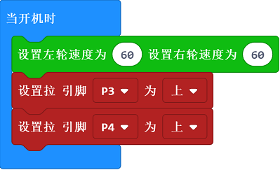
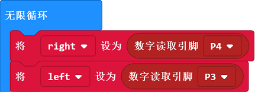
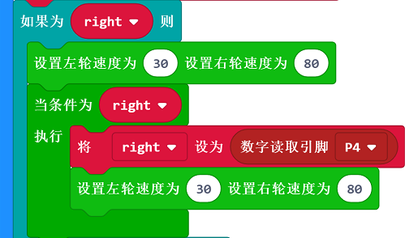
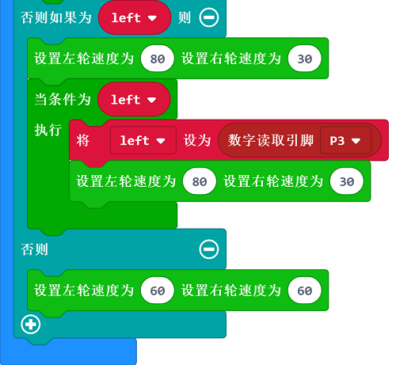

# 案例03 巡线绕圈

## 目的
---

- 使用motor:bit智能车载套件完成巡线绕圈功能。

## 使用材料
---

- 1 x motor:bit 智能车载套件

## 背景知识
---
### 巡迹模块原理

- 该巡迹模块使用的为红外线传感器模块，由一个**发射端**和一个**接收端**组成，发射端发射红外线由地面反射回来由接收端接收。
- 遇到黑色地面或者其他吸收红外光材质的物品时，接收端无法接收到红外线，巡迹模块返回0，巡到白色返回1。

## 硬件连接图
---

如图所示，将巡线模块左边传感器(S1)连接到motor:bit主板的4号引脚，将右边传感器(S2)连接到motor:bit主板的3号引脚。

## 软件
---
[微软makecode](https://makecode.microbit.org/#)在线积木块编程[https://makecode.microbit.org/#](https://makecode.microbit.org/#)

- 当检测到黑线是返回为0，检测不到返回1。

## 编程
---
### 步骤 1
在MakeCode的代码抽屉中点击高级，查看更多代码选项。

为了给motorbit主板编程，我们需要添加一个代码库。在代码抽屉底部找到“扩展”，并点击它。这时会弹出一个对话框。搜索“motorbit"，然后点击下载这个代码库。

注意：如果你得到一个提示说一些代码库因为不兼容的原因将被删除，你可以根据提示继续操作，或者在项目菜单栏里面新建一个项目。

### 步骤 2
在开机启动时设置左右轮电机速度为60，同时将P3和P4设置一个上拉。

设置左右两个红外线传感器的返回值变量Left和right，以数字方式读取左右红外线传感器的返回参数，也就是P3，P4接口。

如果右侧红外线传感器检测到脱离黑线，设置左轮速度为30右轮速度为80，向左转。之后设置一个循环，检测小车是否回归到黑线，如果没有就继续向左转直到回到黑线。

如果左侧红外线传感器检测到脱离黑线，同理向右转回归黑线。如果均为检测到以60速度继续前进。

### 程序
请参考程序连接：[https://makecode.microbit.org/_ibXcm1M5UY3A](https://makecode.microbit.org/_ibXcm1M5UY3A)

你也可以通过以下网页直接下载程序。

<iframe style="position:absolute;top:0;left:0;width:100%;height:100%;" src="https://makecode.microbit.org/#pub:_ibXcm1M5UY3A" frameborder="0" sandbox="allow-popups allow-forms allow-scripts allow-same-origin"></iframe>
  
---
**注意：** 可吸收红外光物体均视为黑线。

## 结论
---
motor:bit小车沿着预定画好的黑线前进。
## 思考
---

## 常见问题
---

## 相关阅读  
---

