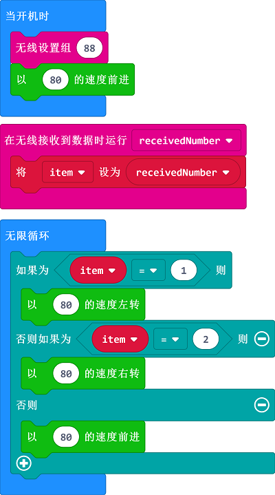

# 案例05 遥控小车

## 目的
---

- 使用motor:bit智能车套件和另一块单独的micro:bit主板完成遥控小车。

## 使用材料
---

- 1 x motor:bit 智能车载套件
- 1 x micro:bit主板

## 背景知识
---
### 什么是无线电

- [无线电](https://en.wikipedia.org/wiki/Radio)无线电技术是通过无线电波传播信号的技术，其原理在于，导体中电流强弱的改变会产生无线电波。利用这一现象，通过调制可将信息加载于无线电波之上。当电波通过空间传播到达收信端，电波引起的电磁场变化又会在导体中产生电流。通过解调将讯息从电流变化中提取出来，就达到了资讯传递的目的。

## 软件
---
[微软makecode](https://makecode.microbit.org/#)在线积木块编程[https://makecode.microbit.org/#](https://makecode.microbit.org/#)

## 编程
---
### 步骤 1
在MakeCode的代码抽屉中点击高级，查看更多代码选项。

为了给motorbit主板编程，我们需要添加一个代码库。在代码抽屉底部找到“扩展”，并点击它。这时会弹出一个对话框。搜索“motorbit"，然后点击下载这个代码库。

注意：如果你得到一个提示说一些代码库因为不兼容的原因将被删除，你可以根据提示继续操作，或者在项目菜单栏里面新建一个项目。

### 步骤 2

- 首先将单独的micro:bit主板作为遥控端，编写遥控端程序。
- 上电启动时，设置无线组别为88，(接受需要和发射一致)。
- 当按钮A按下时，无线发送数字1，当按钮B按下时，无线发送数字2。

### 步骤 3

- 将小车作为遥控的接收端，编写接收端程序。
- 上电启动时，设置无线组别为88，(接受需要和发射一致)。
- 默认小车以80的速度前进。
- 当以数字的方式接收到无线电时，将接收到的数字赋值给`item`变量。
- 循环判断变量`item`的值。如果为 1 以 80 的速度左转。
- 如果为 2 以 80 的速度右转。
- 如果都不是，以 80 的速度前进。
 

### 程序
#### 遥控器端程序
请参考程序连接：[https://makecode.microbit.org/_5yyHJoJsjcH4](https://makecode.microbit.org/_5yyHJoJsjcH4)

你也可以通过以下网页直接下载程序：

<iframe style="position:absolute;top:0;left:0;width:100%;height:100%;" src="https://makecode.microbit.org/#pub:_5yyHJoJsjcH4" frameborder="0" sandbox="allow-popups allow-forms allow-scripts allow-same-origin"></iframe>

#### 智能小车端程序

请参考程序连接：[https://makecode.microbit.org/_Ls6ecibsiMVs](https://makecode.microbit.org/_Ls6ecibsiMVs)

你也可以通过以下网页直接下载程序：

<iframe style="position:absolute;top:0;left:0;width:100%;height:100%;" src="https://makecode.microbit.org/#pub:_Ls6ecibsiMVs" frameborder="0" sandbox="allow-popups allow-forms allow-scripts allow-same-origin"></iframe>

## 现象
---
- 车辆上电以80的速度向前直行，当按下遥控端micro:bit上的A按钮时，小车左转，按下B按钮，小车右转。

## 思考
---

## 常见问题
---

## 相关阅读  
---

