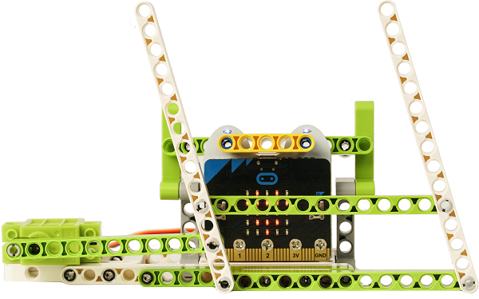
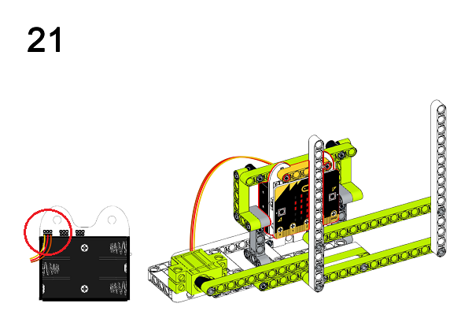

# Ringbit_Bricks_Pack套件案例05：雨刷器

## 目的
---

- 使用Ringbit_Bricks_Pack套件制作雨刷器

## 使用材料
---

## 背景知识
---

## 积木搭建
---

通过下面链接下载PDF文档即可获得详细的搭建步骤图
[Github下载 ](https://github.com/elecfreaks/learn-cn/raw/master/microbitKit/ring_bit_bricks_pack/files/yuguaqi.pdf)

## 软件
---

[微软makecode](https://makecode.microbit.org/#)

## 编程
---

### 步骤 1
 在MakeCode的代码抽屉中点击“高级”，查看更多代码选项。

为了给Ringbit_Bricks_Pack套件编程，我们需要添加一个扩展库。在代码抽屉底部找到“扩展”，并点击它。这时会弹出一个对话框，搜索”servo”，然后点击下载这个代码库。

*注意：*如果你得到一个提示说一些代码库因为不兼容的原因将被删除，你可以根据提示继续操作，或者在项目菜单栏里面新建一个项目。

### 步骤 2

当按钮`A`被按下时，设置连接P0端口的舵机转动180°，当按钮`B`被按下时，设置连接P0端口的舵机转动90°。

*注意：*由于我们使用的是360°舵机，而Makecode的servo扩展库是适用于180°舵机的，所以在使用360°舵机的时候，设置舵机转动到0°或者180°会使舵机顺时针转动或者逆时针转动，当设置舵机转动到90°时，舵机停止转动。

### 程序

请参考程序连接：[https://makecode.microbit.org/_EKiCqYhvAKbb](https://makecode.microbit.org/_EKiCqYhvAKbb)

你也可以通过以下网页直接下载程序。

<iframe style="position:absolute;top:0;left:0;width:100%;height:100%;" src="https://makecode.microbit.org/#pub:_EKiCqYhvAKbb]" frameborder="0" sandbox="allow-popups allow-forms allow-scripts allow-same-origin"></iframe>
  

### 现象
---
当按钮`A`被按下时，雨刷器开始工作，当按钮`B`被按下时，雨刷器停止工作。

## 思考
---

## 常见问题
---
## 相关阅读  
---
平行四边形的平面连杆机构：它是一种铰链四杆机构﹐根据曲柄存在条件属於双曲柄机构。两个曲柄长度相等，且连杆和机架的长度也相等，呈平行四边形，两曲柄的转动速度和方向相同。

往复运动：在某一位置附近两侧来回往返运动。
往复运动的位移等于0,因为是一个正行程,一个负行程。多指机械运动重复往返，例如钟摆、活塞运动等。
