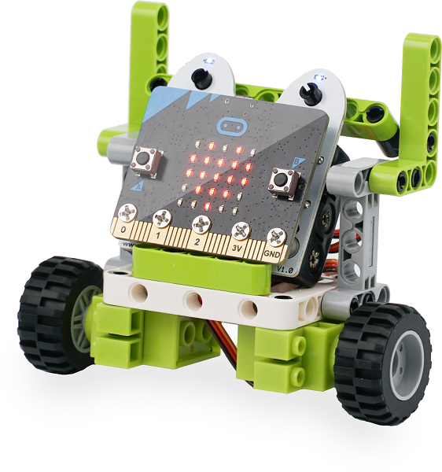
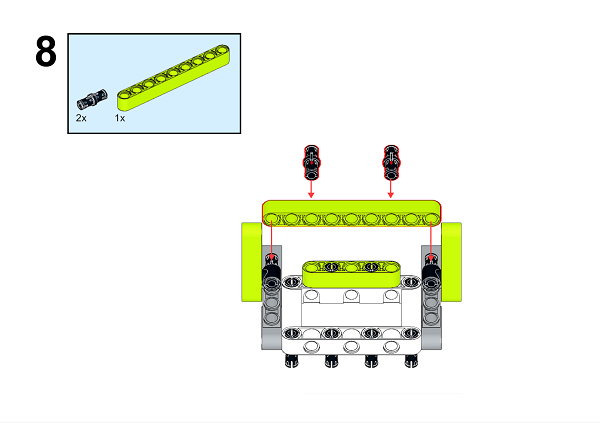
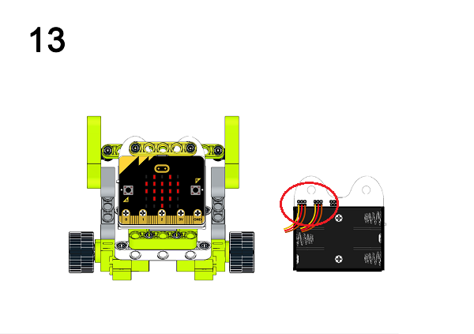
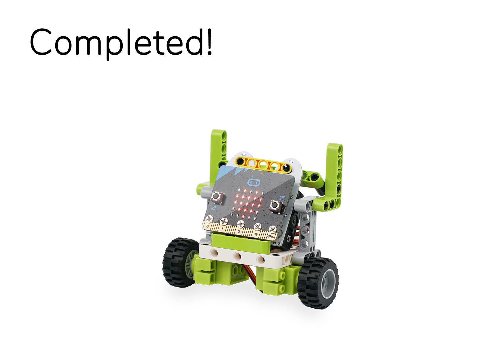

# Ring:bit六合一搭建套件案例02：积木小车

## 目的
---

- 使用Ring:bit六合一搭建套件制作一辆积木小车

## 使用材料
---

## 背景知识
---

## 积木搭建
---

***注意：接线时黄色线需要连接在端口上方标有数字（0\1\2）的位置。

通过下面链接下载PDF文档即可获得详细的搭建步骤图
[Github下载 ](https://github.com/elecfreaks/learn-cn/raw/master/microbitKit/ring_bit_bricks_pack/files/Ringbit_Bricks_Pack_step_02_v1.1.pdf)

## 软件
---

[微软makecode](https://makecode.microbit.org/#)

## 编程
---

### 步骤 1
 在MakeCode的代码抽屉中点击“高级”，查看更多代码选项。

为了给Ringbit_Bricks_Pack套件编程，我们需要添加一个扩展库。在代码抽屉底部找到“扩展”，并点击它。这时会弹出一个对话框，搜索”Ringbit”，然后点击下载这个代码库。

*注意：*如果你得到一个提示说一些代码库因为不兼容的原因将被删除，你可以根据提示继续操作，或者在项目菜单栏里面新建一个项目。

### 步骤 2

在`当开机时`中插入`设置左轮连接P1右轮连接P2`积木块，设置左轮为`P1`口。右轮为`P2`口。

### 步骤 3

如图所示，当按钮`A+B`按下时`全速前进`，当按钮`A`按下时`全速右转`，当按钮`B`按下时`全速左转`，当`屏幕朝下`时`全速后退`，当摇晃小车时`刹车`。

### 程序

请参考程序连接：[https://makecode.microbit.org/_CjrAJLi2mg7w](https://makecode.microbit.org/_CjrAJLi2mg7w)

你也可以通过以下网页直接下载程序。

<iframe style="position:absolute;top:0;left:0;width:100%;height:100%;" src="https://makecode.microbit.org/#pub:_CjrAJLi2mg7w]" frameborder="0" sandbox="allow-popups allow-forms allow-scripts allow-same-origin"></iframe>
  

### 现象
---
当按钮`A+B`按下时小车前进行驶，当按钮`A`按下时小车向右转向，当按钮`B`按下时小车向左转向，当`屏幕朝下`后将小车放置在地面上时，小车向后行驶，当用力摇晃小车时，小车轮子停止转动。

## 思考
---

## 常见问题
---
## 相关阅读  
---
1769年，法国人N·J·居纽制造了世界上第一辆蒸汽驱动的三轮汽车，这辆汽车被命名为“卡布奥雷”。
世界上第一辆汽车是由德国人卡尔·本茨于1885年10月研制成功的，一举奠定了汽车设计基调，即使现在的汽车也跳不出这个框框。他于1886年1月29日向德国专利局申请汽车发明的专利，同年的11月2日专利局正式批准发布。因此，1886年1月29日被公认为是世界汽车的诞生日，本茨的专利证书也成为了世界上第一张汽车专利证书。
1885年，德国人哥特里布·戴姆勒发明了第一辆四轮汽车。
本茨和戴姆勒是人们公认的以内燃机为动力的现代汽车的发明者，他们的发明创造，成为汽车发展史上最重要的里程碑，他们两人因此被世人尊称为“汽车之父”。
