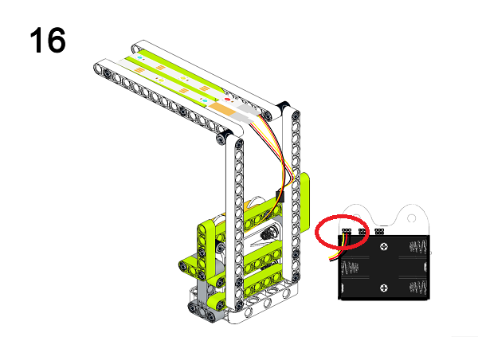

# Ring:bit六合一搭建套件案例04：智能台灯
## 目的
---

- 使用Ring:bit六合一搭建套件制作智能台灯

## 使用材料
---

## 背景知识
---

## 积木搭建
---

通过下面链接下载PDF文档即可获得详细的搭建步骤图
[Github下载 ](https://github.com/elecfreaks/learn-cn/raw/master/microbitKit/ring_bit_bricks_pack/files/Ringbit_Bricks_Pack_step_04_v1.1.pdf)

## 软件
---

[微软makecode](https://makecode.microbit.org/#)

## 编程
---

### 步骤 1
 在MakeCode的代码抽屉中点击“高级”，查看更多代码选项。

为了给Ringbit_Bricks_Pack套件编程，我们需要添加一个扩展库。在代码抽屉底部找到“扩展”，并点击它。这时会弹出一个对话框，搜索”Ringbit”，然后点击下载这个代码库。

*注意：*如果你得到一个提示说一些代码库因为不兼容的原因将被删除，你可以根据提示继续操作，或者在项目菜单栏里面新建一个项目。

### 步骤 2

在`当开机时`中插入`将strip设为流光溢彩灯连接引脚`积木块，设置为`P0`口。初始化灯带`10`颗LED（模式`RGB(GRB顺序)`）。

### 步骤 3

在`无限循环`中判断`亮度级别`积木块的返回值，当亮度级别小于10时，设置灯带显示白色，当亮度级别大于15时，设置灯带显示黑色。

### 程序

请参考程序连接：[https://makecode.microbit.org/_ie6MF0Rhj1P7](https://makecode.microbit.org/_ie6MF0Rhj1P7)

你也可以通过以下网页直接下载程序。

<iframe style="position:absolute;top:0;left:0;width:100%;height:100%;" src="https://makecode.microbit.org/#pub:_ie6MF0Rhj1P7]" frameborder="0" sandbox="allow-popups allow-forms allow-scripts allow-same-origin"></iframe>
  

### 现象
---
当周围亮度过低时，自动亮灯，当周围亮度级别高于设定值时，台灯自动熄灭。

## 思考
---

## 常见问题
---
## 相关阅读  
---
1854年，移民美国的德国钟表匠亨利·戈贝尔用一根放在真空玻璃瓶里的碳化竹丝，制成了首个有实际效用的电灯，持续亮了400个小时，不过他并没及时申请专利。1860年，英国人约瑟夫·斯旺也制成了碳丝电灯，但他未能获得使碳丝保持长时间工作的良好真空环境。直到1878年，英国的真空技术发展到合乎需要的程度，他才发明真空下用碳丝通电的灯泡，并且获得英国专利。斯旺自己的屋子是英国用电照明的第一所私人住宅。
1874年，加拿大的两名电气技师申请了一项电灯专利：在玻璃泡之下充入氮气，以通电的碳杆发光，但他们没有足够财力继续完善这项发明，于是在1875年把专利卖给了爱迪生。爱迪生购入专利后尝试改良灯丝，终于在1880年制造出能持续亮1200个小时的碳化竹丝灯。
不过，美国专利局判爱迪生的碳丝白炽灯发明落于人后，专利无效。打了多年的官司后，亨利·戈培尔赢得专利，最后爱迪生从戈培尔贫困的遗孀手上买下专利。在英国，斯旺控告爱迪生侵犯专利，后来他们在法庭之外和解，于1883年在英国建立一家联合公司。斯旺后来把他的股权及专利都卖给了爱迪生。
20世纪初，碳化灯丝被钨丝取代，钨丝白炽灯沿用至今。
1938年，荧光灯诞生。1998年白光LED灯诞生。
