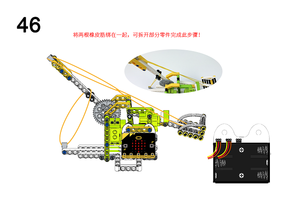

# Ring:bit六合一搭建套件案例06：投石机

## 目的
---

- 使用Ring:bit六合一搭建套件制作投石机

## 使用材料
---

## 背景知识
---

## 积木搭建
---

***注意：接线时黄色线需要连接在端口上方标有数字（0/1/2）的位置。

通过下面链接下载PDF文档即可获得详细的搭建步骤图
[Github下载 ](https://github.com/elecfreaks/learn-cn/raw/master/microbitKit/ring_bit_bricks_pack/files/Ringbit_Bricks_Pack_step_06_v1.1.pdf)

## 软件
---

[微软makecode](https://makecode.microbit.org/#)

## 编程
---

### 步骤 1
 在MakeCode的代码抽屉中点击“高级”，查看更多代码选项。

为了给Ringbit_Bricks_Pack套件编程，我们需要添加一个扩展库。在代码抽屉底部找到“扩展”，并点击它。这时会弹出一个对话框，搜索”servo”，然后点击下载这个代码库。

*注意：*如果你得到一个提示说一些代码库因为不兼容的原因将被删除，你可以根据提示继续操作，或者在项目菜单栏里面新建一个项目。

### 步骤 2

当按钮`A`被按下时，设置连接P1端口的舵机转动180°，暂停300ms，设置连接P1端口的舵机转动90°，暂停1000ms，设置连接P2端口的舵机转动0°，暂停1000ms，设置连接P2端口的舵机转动90°，暂停1000ms，设置连接P1端口的舵机转动0°，暂停300ms，设置连接P1端口的舵机转动90°，暂停500ms，设置连接P2端口的舵机转动180°，暂停1000ms，设置连接P2端口的舵机转动90°，暂停1600ms。

*注意：*由于我们使用的是360°舵机，而Makecode的servo扩展库是适用于180°舵机的，所以在使用360°舵机的时候，设置舵机转动到0°或者180°会使舵机顺时针转动或者逆时针转动，当设置舵机转动到90°时，舵机停止转动。

### 程序

请参考程序连接：[https://makecode.microbit.org/_VdHDyY6HJFso](https://makecode.microbit.org/_VdHDyY6HJFso)

你也可以通过以下网页直接下载程序。

<iframe style="position:absolute;top:0;left:0;width:100%;height:100%;" src="https://makecode.microbit.org/#pub:_VdHDyY6HJFso]" frameborder="0" sandbox="allow-popups allow-forms allow-scripts allow-same-origin"></iframe>
  

### 现象
---
当按钮`A`被按下时，投石机执行发射动作并自动上弹。

## 思考
---

## 常见问题
---
## 相关阅读  
---
