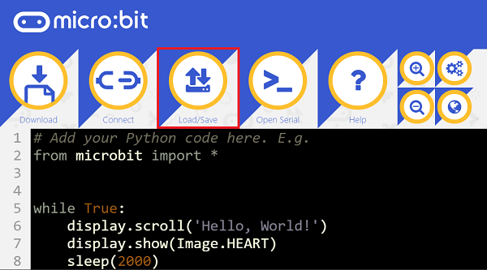
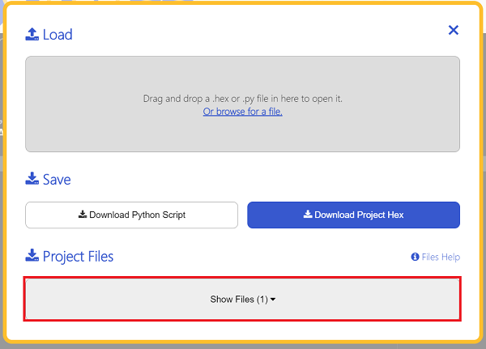
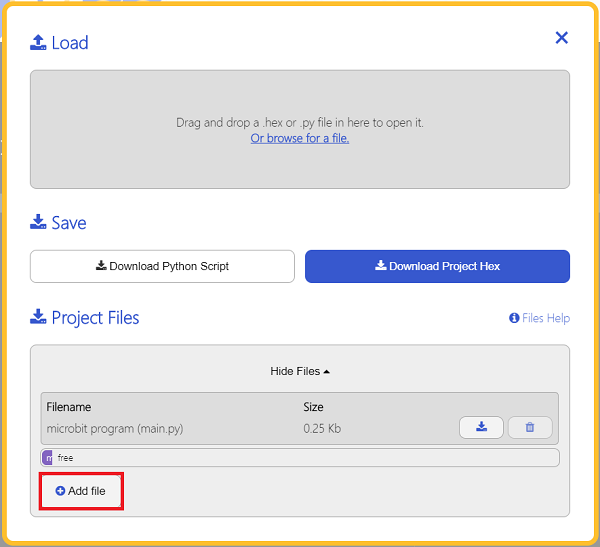
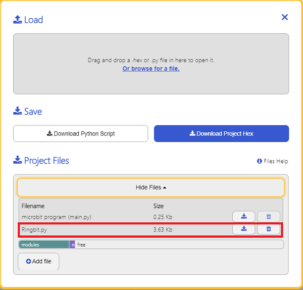

#Ring:bit python使用示例


---


### 添加python文件
下载压缩包并解压[EF_Produce_MicroPython-master](https://github.com/lionyhw/EF_Produce_MicroPython/archive/master.zip)
打开[Python editor](https://python.microbit.org/v/2.0)



为了给Ring:bit编程，我们需要添加Ringbit.py这个文件。点击Load/Save，然后点击Show Files（1）下拉菜单，再点击Add file在本地找到下载并解压完成的EF_Produce_MicroPython-master文件夹，从中选择Ringbit.py这个文件添加进来。







### 示例代码
### 示例一     让小车全速前进
```
from microbit import *
from Ringbit import *

RB = RINGBIT(pin1,pin2)
RB.set_motors_speed(100,100)
# 设置左右轮电机速度

```
### 结果
- Ring:bit左轮速度为100，右轮速度为100，全速前进。


### 示例二    超声波避障小车
```
from microbit import *
from Ringbit import *

RB = RINGBIT(pin1,pin2)
while True:
    i = RB.get_distance(0)
    if i>3 and i<30:
        RB.set_motors_speed(-100, 100)
        sleep(500)
    else:
        RB.set_motors_speed(100, 100)
```
### 结果
- 天蓬智能车在行驶过程中如果遇到障碍物，则立即转向。

### 示例三    巡线行驶
```
from microbit import *
from Ringbit import *

RB = RINGBIT(pin1,pin2)
while True:
    
    i = RB.get_tracking()
    if i == 10:
        RB.set_motors_speed(10, 100)
    if i == 1:
        RB.set_motors_speed(100, 10)   
    if i == 11:
        RB.set_motors_speed(100, 100) 
```
### 结果
- 天蓬智能车巡线行驶。

## 相关案例
---

## 技术文档
---
