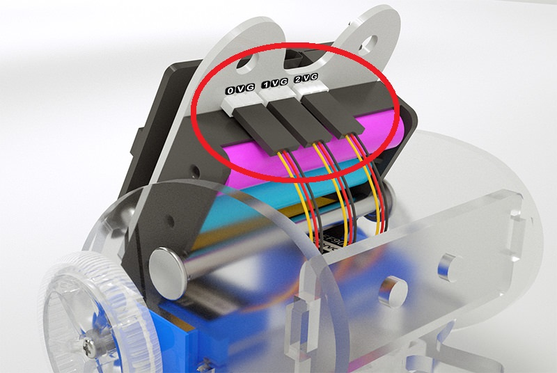

# Ring:bit 小车组装教程

## Ring:bit car 2代零件图
---

## 装配步棸
---
### 步棸1 ###

- 首先将舵机使用自攻螺丝安装固定至侧板。
- 然后将轮子使用自攻螺丝安装固定在舵机。

### 步棸2 ###

- 使用铆钉将万向轮安装固定在尾板。

### 步棸3 ###

- 将前板、后板、尾板、专用扩展板拼插在侧板上。

### 步棸4 ###

- 使用连接柱将小车锁紧。

### 步棸5 ###

- 使用平头螺丝将micro:bit主板安装在Ring:bit上。

### 步棸6 ###

- 按如图接线，连接某个端口可以自定，在编程的时候需要确定。

### 完成 ###

- 将组装好的Ring:bit插在前板上，完成组装。

