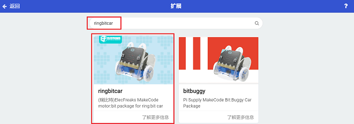
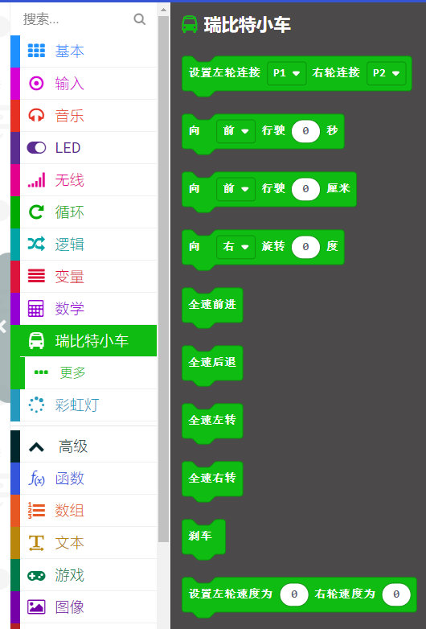

# Ring:bit积木块介绍

## 添加新的extension ##
---
- 如果想使用Ring:bit的扩展积木块，则需要添加新的扩展包。
- 通过以下步骤添加扩展积木块。

### 第一步 ###

- 点击高级，在下拉菜单中点击扩展，进入添加积木块菜单。

### 第二步 ###

- 在搜索框中搜索“ringbitcar”，点击图片中“ring:bit car”，添加扩展包。

### 第三步 ###

- 完成添加。

## 积木块介绍 ##
---

- 在编程之前，必须先使用此积木块设置ring:bit car的左右轮子的端口号，以硬件连接端口为准。

---

使用此积木块，使小车向前或者向后行驶指定时间。

---

使用此积木块，使小车向前或者向后行驶指定距离。（仅供参考，请以实际测试的结果为准）

---

使用此积木块，使小车向左或者向右旋转指定角度。（仅供参考，请以实际测试的结果为准）

---

- 使用此积木块，小车全速前进。

---

- 使用此积木块，小车全速倒退。

---

- 使用此积木块，小车全速左转。

---

- 使用此积木块，小车全速右转。

---

使用此积木块，小车刹车。

---

使用此积木块，可以单独设置左轮和右轮的速度。

---

当你扩展了巡线模块，使用此积木块，来判断左右巡线头的状态。

---

- 当你扩展了超声波测距模块，使用此积木块，获取超声波测距的距离。

---

### 程序
---
- 请参考程序连接：[https://makecode.microbit.org/_AgF9MT0sWAF2](https://makecode.microbit.org/_AgF9MT0sWAF2)

- 你也可以通过以下网页直接下载程序。

<iframe style="position:absolute;top:0;left:0;width:100%;height:100%;" src="https://makecode.microbit.org/#pub:_AgF9MT0sWAF2" frameborder="0" sandbox="allow-popups allow-forms allow-scripts allow-same-origin"></iframe>
  

## 常见问题
---

## 相关阅读  
---
