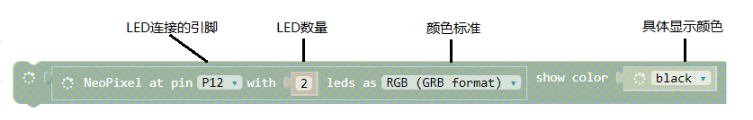

# robit智能小车案例03：彩虹LED

## 目的
---
- 用Robit主板上的LED制作炫彩车灯。

## 使用材料
---

- 1 x Robit智能小车主板
- 1 x Mbot Car

## 背景知识
---

### 彩虹LED

[RGB](https://baike.baidu.com/item/RGB/342517?fr=aladdin)色彩模式是工业界的一种颜色标准，是通过对红(R)、绿(G)、蓝(B)三个颜色通道的变化以及它们相互之间的叠加来得到各式各样的颜色的，RGB即是代表红、绿、蓝三个通道的颜色，这个标准几乎包括了人类视力所能感知的所有颜色，是目前运用最广的颜色系统之一。

彩虹LED是LED的一种，把红色LED、绿色LED、蓝色LED集合成一个元件，就是彩虹 LED。我们都知道，光的三原色分别为红色、绿色、蓝色，利用这三种颜色进行不同组份地组合，能够合成出万物所有的颜色。同样，利用RGB LED进行不同亮度的组合，能够形成无数种颜色。

Robit智能小车主板搭载的是WS2812b智能外控LED灯。其外形与5050灯珠相同，每个元件即为一个像素点。下图显示的是单颗灯珠，它有四个引脚。 

## 硬件连接图
---

板载两颗彩虹LED，连接在micro:bit的P12口。

## 软件
---
[微软makecode](https://makecode.microbit.org/#)

## 编程
---

### 步骤 1

在MakeCode的代码抽屉中点击Advanced，查看更多代码选项。

为了给超声波模块编程，我们需要添加一个代码库。在代码抽屉底部找到“Add Package”，并点击它。这时会弹出一个对话框。搜索“Robit"，然后点击下载这个代码库。

注意：如果你得到一个提示说一些代码库因为不兼容的原因将被删除，你可以根据提示继续操作，或者在项目菜单栏里面新建一个项目。

### 步骤 2

当开机时, 创建一个变量item给LED赋值,将LED的初始颜色设置为0。

创建一个永久循环，将变量item设置为每次循环加5，如果变量item的值等于360范，设置变量item为0以重置循环。

**注意：** 下图为LED代码详解

### 程序
请参考程序连接：[https://makecode.microbit.org/_DLqKtp38EVro](https://makecode.microbit.org/_DLqKtp38EVro)

你也可以通过以下网页直接下载程序。

<iframe style="position:absolute;top:0;left:0;width:100%;height:100%;" src="https://makecode.microbit.org/#pub:_DLqKtp38EVro" frameborder="0" sandbox="allow-popups allow-forms allow-scripts allow-same-origin"></iframe>
  

### 现象

LED循环显示颜色。

## 思考
---
如何让颜色突变，而不是顺滑渐变？

## 常见问题
---
**问：RGB闪烁速度如何变化？**
答：更改变量item的变化率。

## 相关阅读  
---

