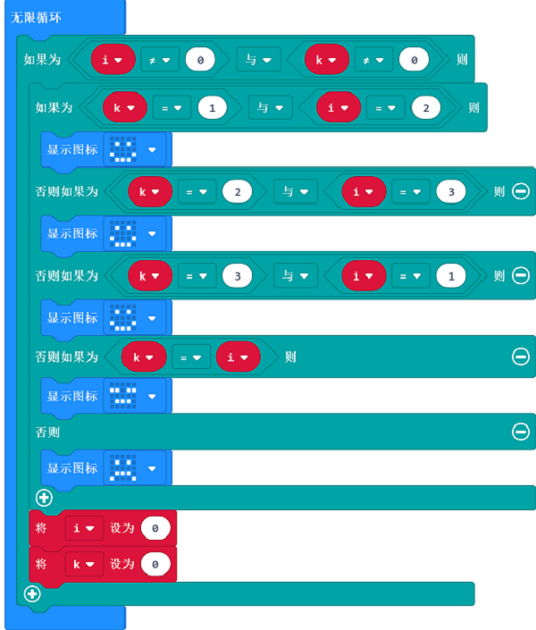

# 案例10：石头剪刀布

## 目的
---
- 使用smart coding kit手表套件完成石头剪刀布。

## 使用材料
---

- 1 x [手表套件Pro（淘宝购买链接）](https://item.taobao.com/item.htm?ft=t&id=582042009614)

## 软件
---
[微软makecode](https://makecode.microbit.org/#)

## 编程
---
### 步骤 1
- 当开机时将变量‘i’和变量‘k’设置为0，显示开机图案
- 设置无线设置组
- 当按键‘A’、‘B’或者‘A+B’被按下时，将变量‘k’设置为相应数字，无线发送变量‘k’的值，并显示相应图案
- 当无线接收到数据时，将数据存入变量`i`

### 步骤 2
- 在无限循环中，判断‘i’和‘k’的值，如果都不等于0，则两名玩家都已经出拳
- 通过对比变量‘i’和变量‘k’的值来判断胜负
- 将变量‘i’和变量‘k’的值设为0，为下次游戏做好准备

### 程序
- 请参考程序连接：[https://makecode.microbit.org/_0HpEjy3Dj8vY](https://makecode.microbit.org/_0HpEjy3Dj8vY)

- 你也可以通过以下网页直接下载程序。

<iframe style="position:absolute;top:0;left:0;width:100%;height:100%;" src="https://makecode.microbit.org/#pub:_0HpEjy3Dj8vY" frameborder="0" sandbox="allow-popups allow-forms allow-scripts allow-same-origin"></iframe>
  
---

## 结论
---

通过按钮`A`和`B`选择出拳，在双方出拳后，自动显示两边胜负，赢家显示笑脸，输家显示哭脸。

## 思考
---

## 常见问题

## 相关阅读  
---

