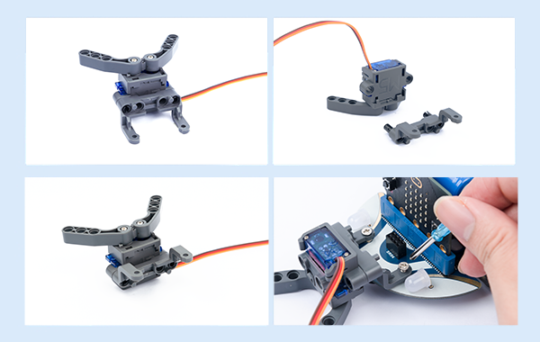
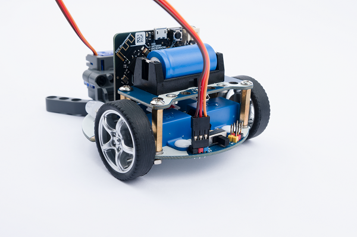
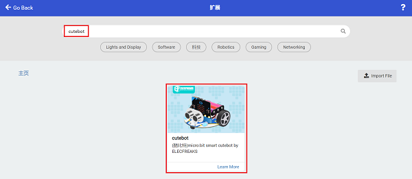
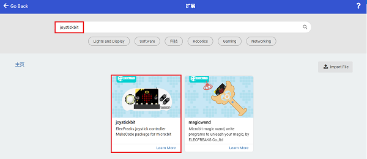

# cutebot-物品抓取小车

## 目的
使用cutebot智能赛车搭配机械爪来制作一辆拥有抓取物品功能的小车。

## 使用材料

1 × [Cutebot 智能赛车](https://www.elecfreaks.com/micro-bit-smart-cutebot.html)

1 × [ELECFREAKS Mechanical Catch](https://www.elecfreaks.com/elecfreaks-mechanical-catch-use-with-cutebot.html)

1 x [Joystick:bit V2](https://www.elecfreaks.com/joystick-bit-2-for-micro-bit.html)

## 安装方式

### 机械爪安装步骤：

### 机械爪连线方式：

将机械爪连接到cutebot智能赛车的S1接口。

## 软件平台

[微软 makecode](https://makecode.microbit.org/#)

## 编程

### 添加扩展
在MakeCode的代码抽屉中点击“高级”，查看更多代码选项。

为了给Cutebot套件编程，我们需要添加一个代码库。在代码抽屉底部找到“扩展”，并点击它。这时会弹出一个对话框。搜索`Cutebot`，然后点击下载这个代码库。

为了给Joystick:bit V2编程，我们需要添加一个代码库。在代码抽屉底部找到“扩展”，并点击它。这时会弹出一个对话框。搜索`Joystick:bit V2`，然后点击下载这个代码库。

*注意：如果你得到一个提示说一些代码库因为不兼容的原因将被删除，你可以根据提示继续操作，或者在项目菜单栏里面新建一个项目。*

### 程序
### 小车端

请参考程序连接：[https://makecode.microbit.org/_H4MdUR2yChCp](https://makecode.microbit.org/_H4MdUR2yChCp)

你也可以通过以下网页直接下载程序。

<iframe style="position:absolute;top:0;left:0;width:100%;height:100%;" src="https://makecode.microbit.org/#pub:https://makecode.microbit.org/_H4MdUR2yChCp" frameborder="0" sandbox="allow-popups allow-forms allow-scripts allow-same-origin">
</iframe>

  

### 遥控端

请参考程序连接：[https://makecode.microbit.org/_6fy3K4Xctdgz](https://makecode.microbit.org/_6fy3K4Xctdgz)

你也可以通过以下网页直接下载程序。

<iframe style="position:absolute;top:0;left:0;width:100%;height:100%;" src="https://makecode.microbit.org/#pub:https://makecode.microbit.org/_6fy3K4Xctdgz" frameborder="0" sandbox="allow-popups allow-forms allow-scripts allow-same-origin">
</iframe>

  

## 结论

如果通过遥控器的摇杆控制小车的行驶方向，按下遥控器的C\D按键控制机械爪的张开和抓取动作。

## 思考

## 常见问题
## 相关阅读  
