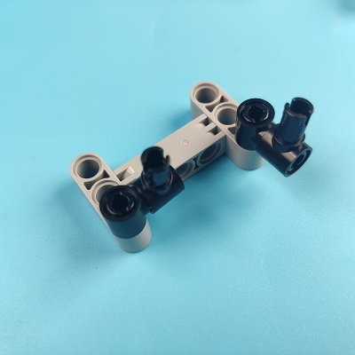

# 颜色卡片控制cutebot小车

## 目的
使用cutebot智能赛车搭配AI摄像头实现小车根据卡片颜色来自动启动和停车的功能。

## 使用材料
1 × [Cutebot 智能赛车](https://www.elecfreaks.com/micro-bit-smart-cutebot.html)
1 × [Cutebot套件锂电池扩展包](https://www.elecfreaks.com/cutebot-lithium-battery-pack.html)
1 × [AI摄像头](https://www.elecfreaks.com/elecfreaks-smart-ai-lens-kit.html)

*注意：AI摄像头适用于 Cutebot V 3.0以上（可以看到底板上打印的版本号）。*

## 安装方式
### 锂电池安装步骤：

### 积木支架结构搭建步骤：

零件清单：

搭建步骤：

### AI摄像头连线方式：
将连接线的RJ11接口的一端连接到AI摄像头，另一端杜邦线接口的一端连接到下图所示的位置，需要注意连接线的接口是否正确。

*注意：这个积木支架结构是可以活动的，我们可以手动调节AI摄像头的视角，在使用AI摄像头时，应该根据功能需求来调节角度。*

## 软件平台
[微软 makecode](https://makecode.microbit.org/#)

## 编程

### 步骤 1
在代码抽屉找到“扩展”，并点击它。

为了给Cutebot套件编程，我们需要添加一个代码库。搜索`Cutebot`，然后点击下载这个代码库。

为了给AI摄像头编程，我们需要添加一个代码库。在代码抽屉底部找到“扩展”，并点击它。这时会弹出一个对话框。搜索` PlanetX-AI`，然后点击下载这个代码库。

*注意：如果你得到一个提示说一些代码库因为不兼容的原因将被删除，你可以根据提示继续操作，或者在项目菜单栏里面新建一个项目。*

### 步骤 2

在`当开机时`中，初始化AI摄像头，切换摄像头功能为颜色识别模式，初始化彩虹灯。

在`无限循环`中，从摄像头获取一帧图像的信息，如果图像中包含红色卡片，则小车停止行驶并显示红色灯光，如果图像中包含绿色卡片，则小车向前行驶并显示绿色灯光。

### 程序

请参考程序连接：[https://makecode.microbit.org/_2781gFCseJMs](https://makecode.microbit.org/_2781gFCseJMs)

你也可以通过以下网页直接下载程序。

<iframe style="position:absolute;top:0;left:0;width:100%;height:100%;" src="https://makecode.microbit.org/#pub:https://makecode.microbit.org/_2781gFCseJMs" frameborder="0" sandbox="allow-popups allow-forms allow-scripts allow-same-origin">
</iframe>

  

## 结论

AI摄像头检测到红色卡片时，小车停止行驶并显示红色灯光，AI摄像头检测到绿色卡片时，小车继续向前行驶并显示绿色灯光。

## 思考

是否可以为cutebot智能赛车设置更多的功能，并通过识别颜色卡片的方式来切换功能。

## 常见问题
---
## 相关阅读  
---