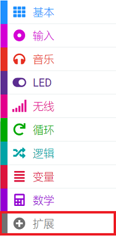
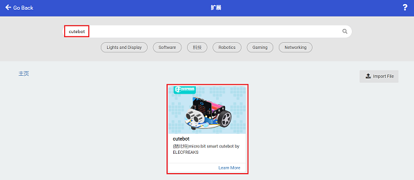
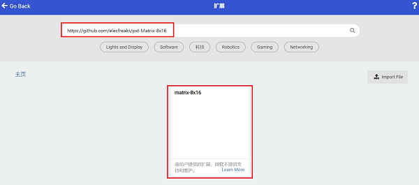

# 生气的cutebot

## 目的
通过8×16点阵屏幕显示表情。

## 使用材料

1 × [Cutebot 智能赛车](https://www.elecfreaks.com/micro-bit-smart-cutebot.html)

1 × [ELECFREAKS 8x16 Matrix Module](https://www.elecfreaks.com/8x16-matrix-module.html)

### 硬件连接
将8*16点阵屏插入cutebot智能赛车的IIC接口，需要注意连接接口是否正确。

## 软件平台
[微软 makecode](https://makecode.microbit.org/#)

## 编程
### 添加扩展
在MakeCode的代码抽屉中点击“高级”，查看更多代码选项。

为了给Cutebot套件编程，我们需要添加一个代码库。在代码抽屉底部找到“扩展”，并点击它。这时会弹出一个对话框。搜索`Cutebot`，然后点击下载这个代码库。

为了给8*16点阵屏编程，我们需要添加一个代码库。在代码抽屉底部找到“扩展”，并点击它。这时会弹出一个对话框。搜索` https://github.com/elecfreaks/pxt-Matrix-8x16 `，然后点击下载这个代码库。

*注意：如果你得到一个提示说一些代码库因为不兼容的原因将被删除，你可以根据提示继续操作，或者在项目菜单栏里面新建一个项目。*

### 程序

请参考程序连接：[https://makecode.microbit.org/_8TiMd6VcEd6f](https://makecode.microbit.org/_8TiMd6VcEd6f)

你也可以通过以下网页直接下载程序。

<iframe style="position:absolute;top:0;left:0;width:100%;height:100%;" src="https://makecode.microbit.org/#pub:https://makecode.microbit.org/_8TiMd6VcEd6f" frameborder="0" sandbox="allow-popups allow-forms allow-scripts allow-same-origin">
</iframe>

  

## 结论

当micro:bit V2的徽标被触摸，则8×16点阵屏显示表情，并且cutebot智能赛车向前行驶。

## 思考

