# 格斗小车3

## 目的
使用cutebot智能赛车制作一辆可以将对手推出比赛场地或者失去移动能力的小车。

## 使用材料
1 × [Cutebot 智能赛车](https://www.elecfreaks.com/micro-bit-smart-cutebot.html)
1 × [Cutebot套件锂电池扩展包](https://www.elecfreaks.com/cutebot-lithium-battery-pack.html)
n × 积木零件（积木零件需要自行准备）

## 安装方式
### 锂电池安装步骤：

### 积木支架结构搭建步骤：

零件清单：

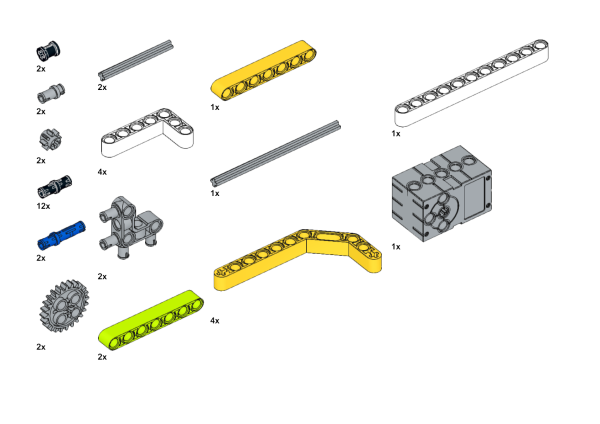

搭建步骤：

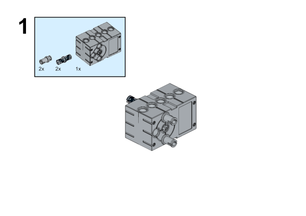

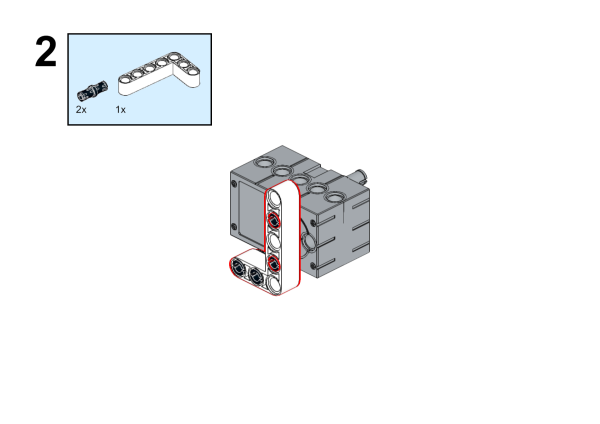

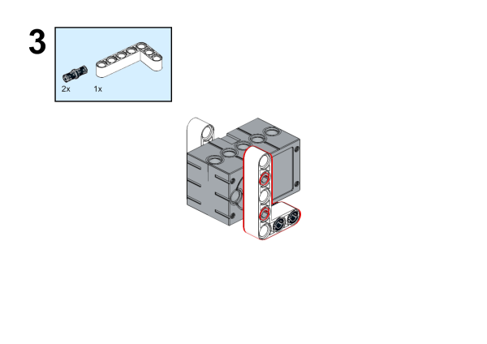

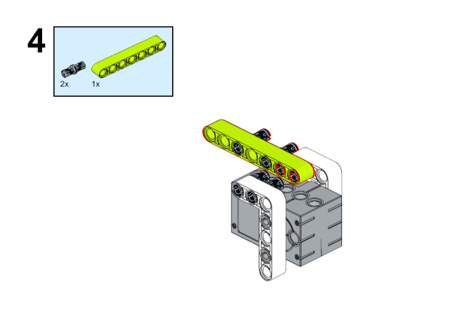

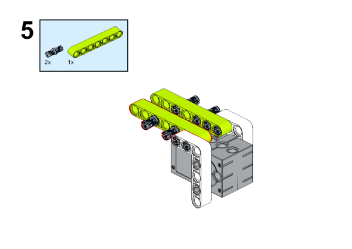

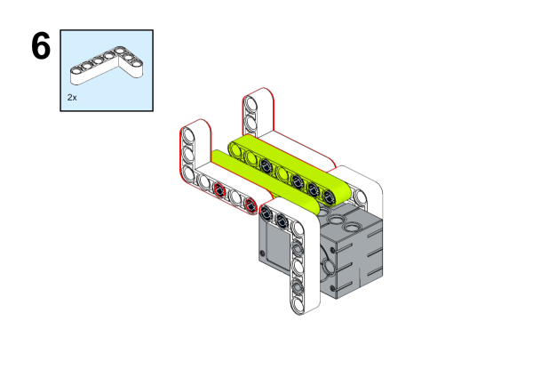

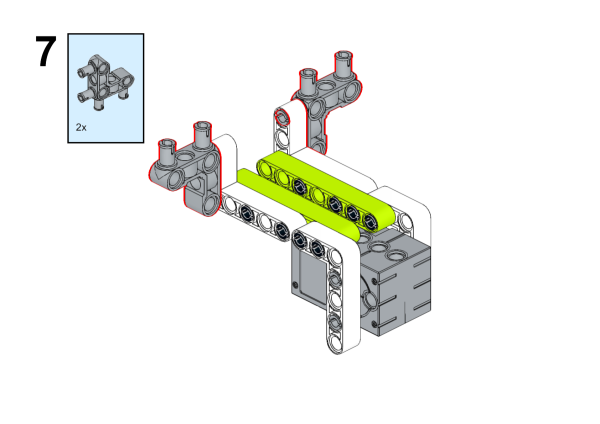

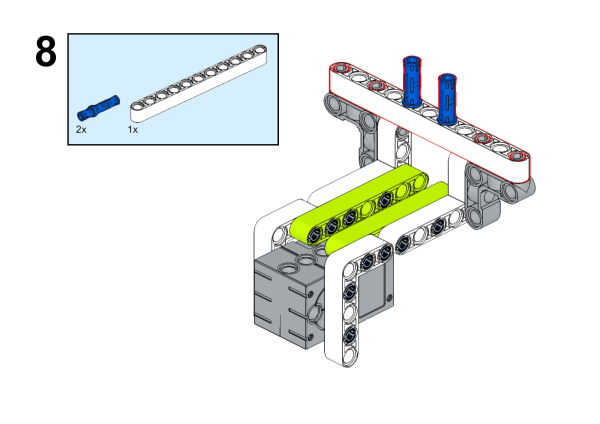

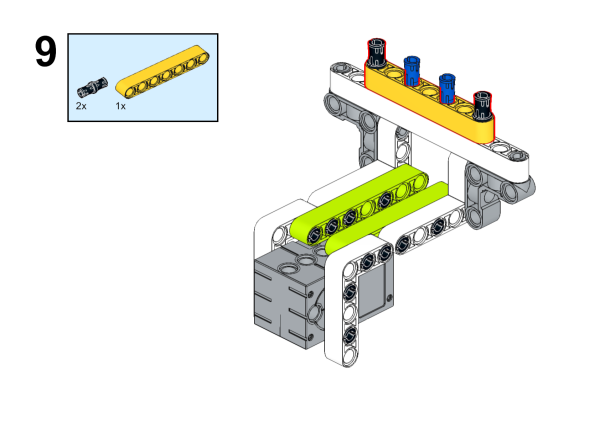

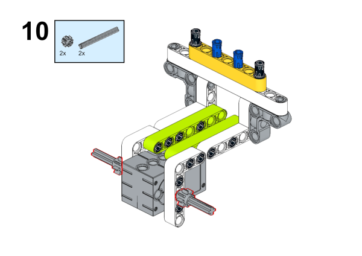

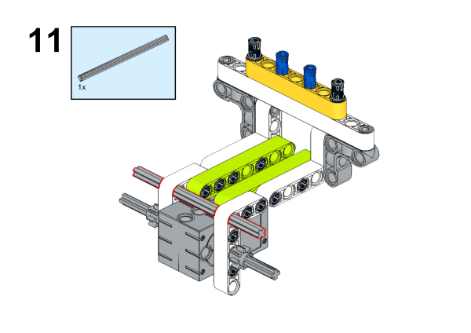

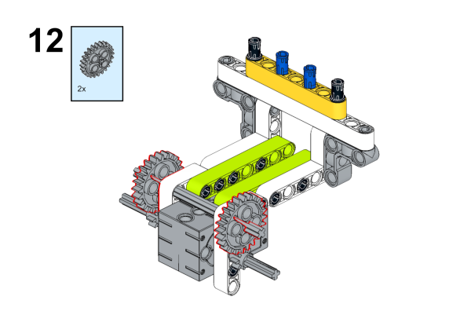

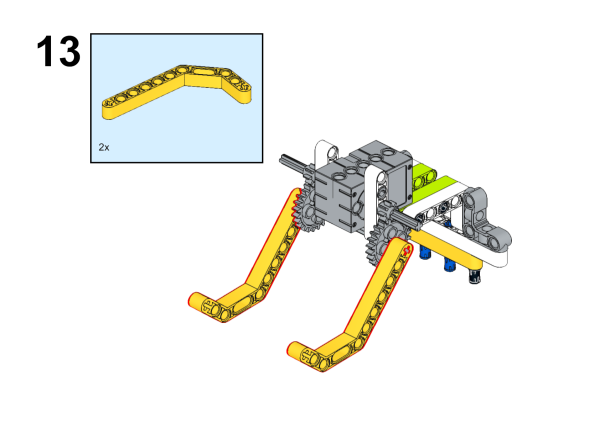

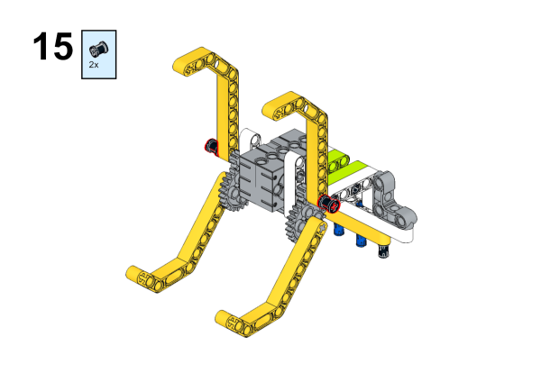

## 连线方式

将舵机连接到cutebot智能赛车的S1接口。

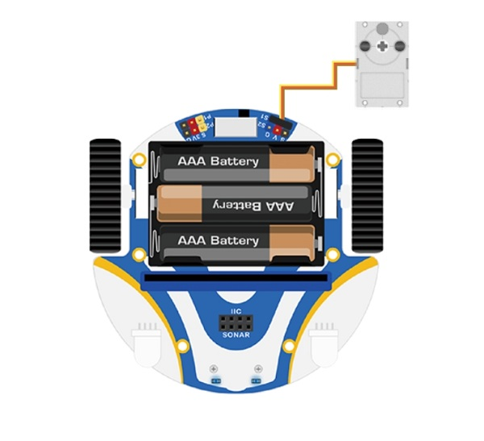

## 软件平台

[微软 makecode](https://makecode.microbit.org/#)

## 编程

### 添加扩展
在MakeCode的代码抽屉中点击“高级”，查看更多代码选项。

为了给Cutebot套件编程，我们需要添加一个代码库。在代码抽屉底部找到“扩展”，并点击它。这时会弹出一个对话框。搜索`Cutebot`，然后点击下载这个代码库。

为了给Joystick:bit V2编程，我们需要添加一个代码库。在代码抽屉底部找到“扩展”，并点击它。这时会弹出一个对话框。搜索`Joystick:bit V2`，然后点击下载这个代码库。

*注意：如果你得到一个提示说一些代码库因为不兼容的原因将被删除，你可以根据提示继续操作，或者在项目菜单栏里面新建一个项目。*

### 程序
### 小车端

请参考程序连接：[https://makecode.microbit.org/_6kD6KAaEfA8W](https://makecode.microbit.org/_6kD6KAaEfA8W)

你也可以通过以下网页直接下载程序。

<iframe style="position:absolute;top:0;left:0;width:100%;height:100%;" src="https://makecode.microbit.org/#pub:https://makecode.microbit.org/_6kD6KAaEfA8W" frameborder="0" sandbox="allow-popups allow-forms allow-scripts allow-same-origin">
</iframe>

  

### 遥控端

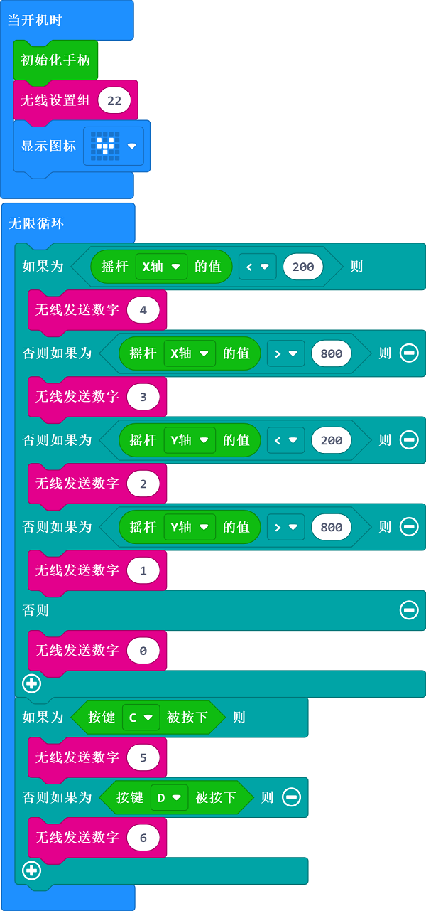

请参考程序连接：[https://makecode.microbit.org/_6fy3K4Xctdgz](https://makecode.microbit.org/_6fy3K4Xctdgz)

你也可以通过以下网页直接下载程序。

<iframe style="position:absolute;top:0;left:0;width:100%;height:100%;" src="https://makecode.microbit.org/#pub:https://makecode.microbit.org/_6fy3K4Xctdgz" frameborder="0" sandbox="allow-popups allow-forms allow-scripts allow-same-origin">
</iframe>

  

## 结论

如果通过遥控器的摇杆控制小车的行驶方向，按下遥控器的C\D按键控制舵机动作。
