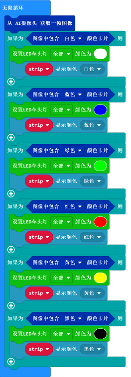

# 变色车灯

## 目的
---
- 使用cutebot智能赛车搭配AI摄像头实现根据识别的颜色调整车灯颜色的功能。

## 使用材料
---
- 1 × [Cutebot V3.0](https://www.elecfreaks.com/store/cute-bot.html)
- 1 × [Cutebot套件锂电池扩展包](https://www.elecfreaks.com/cutebot-lithium-battery-pack.html)
- 1 × [AI摄像头](https://www.elecfreaks.com/elecfreaks-smart-ai-lens-kit.html)

*注意：AI摄像头适用于 Cute bot V 3.0只有（可以看到底板上打印的版本号）。*

## 安装方式
---
### 锂电池安装步骤：

### 积木支架结构搭建步骤：

零件清单：

搭建步骤：

### AI摄像头连线方式：
将连接线的RJ11接口的一端连接到AI摄像头，另一端杜邦线接口的一端连接到下图所示的位置，需要注意连接线的接口是否正确。

*注意：这个积木支架结构是可以活动的，我们可以手动调节AI摄像头的视角，在使用AI摄像头时，应该根据功能需求来调节角度。*

## 软件平台
---
[微软 makecode](https://makecode.microbit.org/#)

## 编程
---
### 步骤 1
- 在MakeCode的代码抽屉中点击“高级”，查看更多代码选项。

- 为了给Cutebot套件编程，我们需要添加一个代码库。在代码抽屉底部找到“扩展”，并点击它。这时会弹出一个对话框。搜索`Cutebot`，然后点击下载这个代码库。

为了给AI摄像头编程，我们需要添加一个代码库。在代码抽屉底部找到“扩展”，并点击它。这时会弹出一个对话框。搜索` https://github.com/elecfreaks/pxt-PlanetX-AI`，然后点击下载这个代码库。

*注意：如果你得到一个提示说一些代码库因为不兼容的原因将被删除，你可以根据提示继续操作，或者在项目菜单栏里面新建一个项目。*

### 步骤 2

- 在`当开机时`中，初始化AI摄像头，切换摄像头功能为颜色识别模式，初始化转向示廓灯为P15端口。

- 在`无限循环`中，从摄像头获取一帧图像的信息，并判断图像中识别到的卡片颜色，如果识别到白色卡片，则设置LED车头灯以及转向示廓灯显示白色，如果识别到蓝色卡片，则设置LED车头灯以及转向示廓灯显示蓝色，以此类推，设置摄像头识别到绿色、红色、黄色、黑色的时候的车灯颜色。

### 程序

请参考程序连接：[https://makecode.microbit.org/_EL876k2ykeaW](https://makecode.microbit.org/_EL876k2ykeaW)

你也可以通过以下网页直接下载程序。

<iframe style="position:absolute;top:0;left:0;width:100%;height:100%;" src="https://makecode.microbit.org/#pub:https://makecode.microbit.org/_EL876k2ykeaW" frameborder="0" sandbox="allow-popups allow-forms allow-scripts allow-same-origin">
</iframe>

  
---

## 结论
---
- 当小车根据摄像头识别到的颜色改变灯光颜色。

## 思考
---

## 常见问题
---
## 相关阅读  
---
