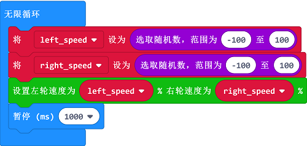

# 案例04:随便跑跑

## 目的
---
- 让你的Cute:bot智能赛车像是有思维一样，以他的想法前进，后退转向等。

## 使用材料
---
- 1 x [Cutebot套件](https://item.taobao.com/item.htm?spm=a1z10.3-c-s.w4002-18602834180.23.78b86655ZP5Yg8&id=598365555295)

## 软件平台
---
[微软 makecode](https://makecode.microbit.org/#)

## 编程
---
### 步骤 1
- 在MakeCode的代码抽屉中点击高级，查看更多代码选项。

- 为了给Cutebot套件编程，我们需要添加一个代码库。在代码抽屉底部找到“扩展”，并点击它。这时会弹出一个对话框。搜索`Cutebot`，然后点击下载这个代码库。

注意：如果你得到一个提示说一些代码库因为不兼容的原因将被删除，你可以根据提示继续操作，或者在项目菜单栏里面新建一个项目。

### 步骤 2

- 在`当开机时`积木块中显示图标，选择一颗心；

### 步骤 3

- 在`无限循环`积木块中设置两个变量`left_speed`和`right_speed`，用于控制左右轮的速度，分别生成`-100`到`100`的随机数赋值到这两个变量里。
- 然后将左右轮速度设置为这两个变量。

### 程序

请参考程序连接：[https://makecode.microbit.org/_5JvPFydDM59f](https://makecode.microbit.org/_5JvPFydDM59f)

你也可以通过以下网页直接下载程序。

<iframe style="position:absolute;top:0;left:0;width:100%;height:100%;" src="https://makecode.microbit.org/#pub:https://makecode.microbit.org/_5JvPFydDM59f" frameborder="0" sandbox="allow-popups allow-forms allow-scripts allow-same-origin">
</iframe>

  
---

## 结论
---
- 小车随机前进，后退或者转向。

## 思考
---

## 常见问题
---
## 相关阅读  
---
