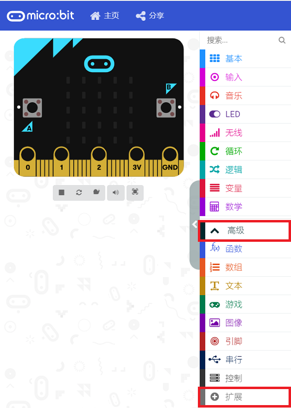
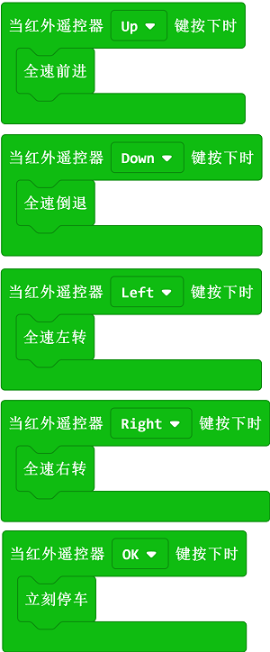

# 案例14:红外遥控小车

## 目的
---
- 使用红外遥控器控制Cutebot智能赛车

## 使用材料
---
- 1 x Cutebot套件
- 1 x 红外遥控器
## 软件平台
---
[微软 makecode](https://makecode.microbit.org/#)

## 编程
---
### 步骤 1
- 在MakeCode的代码抽屉中点击“高级”，查看更多代码选项。

- 为了给Cutebot套件编程，我们需要添加一个代码库。在代码抽屉底部找到“扩展”，并点击它。这时会弹出一个对话框。搜索`Cutebot`，然后点击下载这个代码库。

注意：如果你得到一个提示说一些代码库因为不兼容的原因将被删除，你可以根据提示继续操作，或者在项目菜单栏里面新建一个项目。

### 步骤 2

- 在`当开机时`积木块中显示一个图标。

### 步骤 3

- 设置`当红外遥控器Up键按下时`小车`全速前进`，`当红外遥控器Down键按下时`小车`全速倒退`，`当红外遥控器Left键按下时`小车`全速左转`，`当红外遥控器Right键按下时`小车`全速右转`，`当红外遥控器OK键按下时`小车`立刻停车`。

### 程序

请参考程序连接：[https://makecode.microbit.org/_1mvVwXChAa1k](https://makecode.microbit.org/_1mvVwXChAa1k)

你也可以通过以下网页直接下载程序。

<iframe style="position:absolute;top:0;left:0;width:100%;height:100%;" src="https://makecode.microbit.org/#pub:https://makecode.microbit.org/_1mvVwXChAa1k" frameborder="0" sandbox="allow-popups allow-forms allow-scripts allow-same-origin">
</iframe>

  
---

## 结论
---
- 通过红外遥控器控制小车前进、后退、左转、右转、停车。

## 思考
---

## 常见问题
---
## 相关阅读  
---
