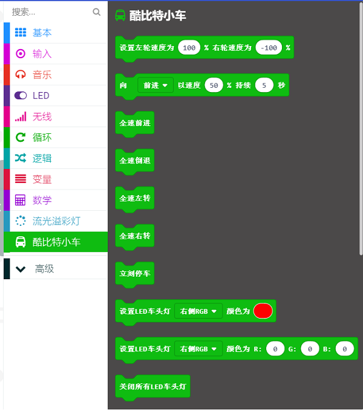

## 添加新的extension 
---
- 如果想使用Cute:bot的扩展积木块，则需要添加新的扩展包。
- 通过以下步骤添加扩展积木块。

### 第一步 

- 点击高级(Advanced)，在下拉菜单中点击扩展(Extensions)，进入添加积木块菜单。

### 第二步 

- 在搜索框中搜索“Ringbit”，点击图片中“ring:bit car”，添加扩展包。

### 第三步 

- 完成添加。

## 积木块介绍 
---

- 使用此积木块可以单独调整左右轮的速度。

---

- 使用此积木块，小车全速前进。

---

- 使用此积木块，小车全速倒退。

---

- 使用此积木块，小车全速左转。

---

- 使用此积木块，小车全速右转。

---

- 当你扩展了巡线模块，使用此积木块，来判断左右巡线状态。

---

- 当你扩展了超声波测距模块，使用此积木块，获取超声波测距的距离。

---

- 使用此积木块控制左右RGB车灯显示的颜色。

## 常见问题
---

## 相关阅读  
---
