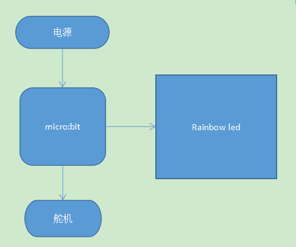
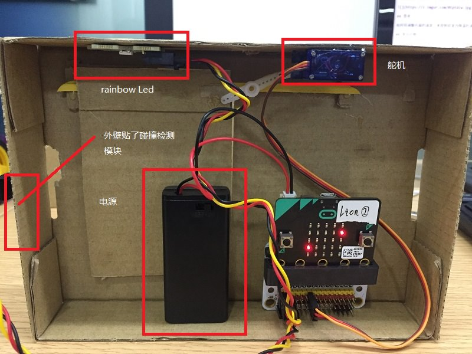
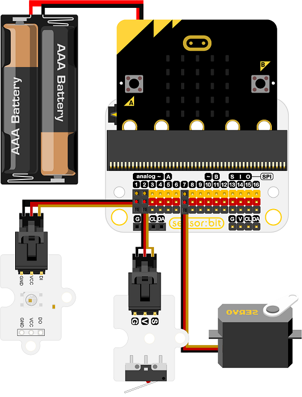

# 案例03 智能衣柜

## 目的
---

- 制作一个智能衣柜。

## 使用材料
---

- 1 x Smart home Kit
- 1 x 瓦楞纸板

## 背景知识
---
### 什么是智能衣柜
- 智能衣柜方便人自动开启拿取衣物，
用手轻轻一按，衣柜门就能灵敏的打开。同时，衣柜门滑动设置成了轻盈噪音低的模式，不影响人们的作息，通过按钮一键打开和关闭衣柜，除去了手动开门时吵醒家人的尴尬场景，又省时省力高端大气。
### 智能衣柜原理
- 通过micro：bit 控制碰撞检测模块，接收碰撞信号，当接收到信号，控制舵机模块打开衣柜门，同时打开照明灯，未接收到信号则保持不变，控制照明灯为熄灭状态。

## 结构场景搭建
---
准备一把美工刀和一些瓦楞纸板。

搭建成如图样式：

正面：

背面：

将元器件按如图摆放黏贴。

## 硬件连接图
---

## 软件
---
[微软makecode](https://makecode.microbit.org/#)

IO口使用注意事项

## 编程
---
### 步骤 1
在MakeCode的代码抽屉中点击Smartthome，查看更多代码选项。

为了给智慧家居套件编程，我们需要添加一个代码库。在代码抽屉底部找到“Add Package”，并点击它。这时会弹出一个对话框。搜索“smarthome"，然后点击下载这个代码库。

注意：如果你得到一个提示说一些代码库因为不兼容的原因将被删除，你可以根据提示继续操作，或者在项目菜单栏里面新建一个项目。

### 步骤 2

在Basic中拖出一个on start积木块，在其中插入set pull积木块将p2拉为高电平。

从pin中拖出一servo积木块，选择p7口，将p7口设为180度，将舵机设置为一个关门的状态。

### 步骤 3

在forever积木块中，首先判断p2引脚的值是否为0，满足条件，将门这个变量的状态取反之后判断变量是否为高电平，如果满足高电平，点亮rainbow led，然后将舵机状态设置为0转动180度达到开门的效果。

### 步骤 4

如果取反后不满足高电平，那么将舵机设置为180度的状态，并且将rainbow led保持熄灭状态。

### 程序

请参考程序连接：[https://makecode.microbit.org/_2J3VR42c29cw](https://makecode.microbit.org/_2J3VR42c29cw)

你也可以通过以下网页直接下载程序。

<iframe style="position:absolute;top:0;left:0;width:100%;height:100%;" src="https://makecode.microbit.org/#pub:_2J3VR42c29cw" frameborder="0" sandbox="allow-popups allow-forms allow-scripts allow-same-origin"></iframe>
  
---

## 结论
---
当触碰模块作为按钮被点亮，舵机状态被设置为0，转动180度，带动衣柜门打开，同时rainbow led被点亮照明，方便拿取衣物。

正面：

背面：

## 思考
---
如何设置一个衣物架，将高处的衣物降下来，方便拿取。

## 常见问题
---

## 相关阅读  
---

