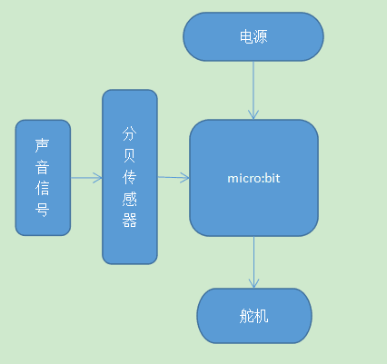
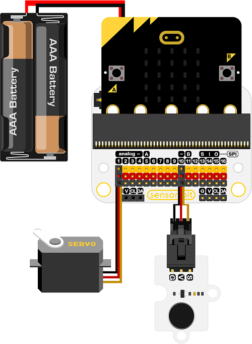

# 案例04 智能控噪门窗

## 目的
---

- 制作一个智能门窗。

## 使用材料
---

- 1 x Smart home Kit
- 1 x 瓦楞纸板

## 背景知识
---
### 什么是智能门窗
- 噪声污染是生活当中都会遇到的问题，房内声贝大于70分贝时会对人的健康产生影响，借助miro：bit设计一个当外部噪声超过70分贝时，自动关闭门窗的智能设备。
### 智能门窗原理
- 由micro：bit控制分贝接收模块接收外部信号，micro：bit判断声贝是否符合标准，大于70分贝，控制舵机关闭门窗。

## 结构场景搭建
---
准备一把美工刀和一些瓦楞纸板。

搭建成如图样式：

正面：

背面：

将元器件按如图摆放黏贴。

## 硬件连接图
---

## 软件
---
[微软makecode](https://makecode.microbit.org/#)

[IO口使用注意事项](https://www.elecfreaks.com/learn-cn/Edge_Connector_Data_Sheet/)

## 编程
---
### 步骤 1

在MakeCode的代码抽屉中点击Smartthome，查看更多代码选项。

为了给智慧家居套件编程，我们需要添加一个代码库。在代码抽屉底部找到“Add Package”，并点击它。这时会弹出一个对话框。搜索“smarthome"，然后点击下载这个代码库。

注意：如果你得到一个提示说一些代码库因为不兼容的原因将被删除，你可以根据提示继续操作，或者在项目菜单栏里面新建一个项目。

### 步骤 2

在Basic中拖出一个on start积木块，在其中插入servo write积木块将p1设置为低电平。

### 步骤 3

在forever积木块中，拖入set to 模块将分贝检测模块中的分贝数值赋值给noise变量。

### 步骤 4

判断返回的变量值是否大于70分贝，如果大于70分贝成立，拖入servo积木块将p1口设置为0度，关闭门窗。

### 步骤 5
如果返回的变量值小于70分贝，将保持舵机初始状态。设置p1口为100度，打开门窗。

### 程序

请参考程序连接：[https://makecode.microbit.org/_PyELU94qWPYD](https://makecode.microbit.org/_PyELU94qWPYD)

你也可以通过以下网页直接下载程序。

<iframe style="position:absolute;top:0;left:0;width:100%;height:100%;" src="https://makecode.microbit.org/#pub:_PyELU94qWPYD" frameborder="0" sandbox="allow-popups allow-forms allow-scripts allow-same-origin"></iframe>
  
---

## 结论
---
当噪声大于70分贝，micro：bit控制舵机打开门窗，当噪声小于70分贝，micro：bit控制舵机保持原本关闭状态。

正面：

背面：

## 思考
---
如何根据室内温度，判断是否打开门窗通风。

## 常见问题
---

## 相关阅读  
---

