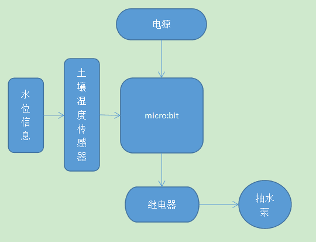
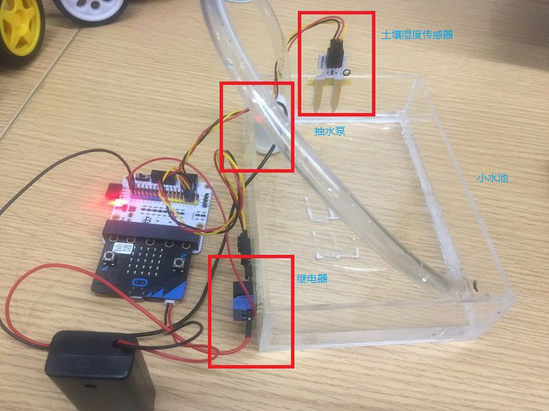
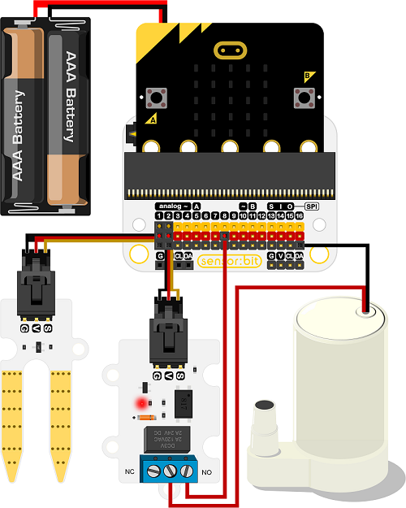

# 案例05 水位监测器

## 目的
---

- 制作一个水位监测器。

## 使用材料
---

- 1 x [智能家居套件（含主板）](https://item.taobao.com/item.htm?ft=t&id=609328225464)
- 1 x 小水池

## 背景知识
---
### 什么是水位监测器
- 大禹治水是治理黄河水灾，生活中不能缺少水，但水过多同样会造成灾害，水位监测器可以实时监测水位，超过警戒水位时，使用micro：bit控制抽水泵抽出多余的水，防止水灾蔓延。
### 水位监测器原理
- 通过micro：bit接收土壤湿度传感器的信号，当接收到信号，控制继电器模块打开，给抽水泵供电，抽取多余的水。

## 结构场景搭建
---
准备一个小水池，搭建成如图样式，将原件如图摆放粘贴：

## 硬件连接图
---

## 软件
---
[微软makecode](https://makecode.microbit.org/#)

IO口使用注意事项

## 编程
---
### 步骤 1
在MakeCode的代码抽屉中点击“高级”，查看更多代码选项。

为了给智慧家居套件编程，我们需要添加一个代码库。在代码抽屉底部找到“扩展”，并点击它。这时会弹出一个对话框。搜索“smarthome"，然后点击下载这个代码库。

注意：如果你得到一个提示说一些代码库因为不兼容的原因将被删除，你可以根据提示继续操作，或者在项目菜单栏里面新建一个项目。

### 步骤 2

在“无限循环”积木块中，加入循环判断条件积木块，从“引脚”函数块中加入“模拟读取引脚” 读取p2的值，判断是否大于500，也就是是否达到警戒水位，从土壤湿度传感器中传入的数值大于500为达到警戒水位，条件成立，低于500说明还未达到警戒水位。

### 步骤 3

条件成立后，发出警戒警报声，拖入“播放旋律”积木块设置为ba ding 发出一次，拖入“向引脚数字写入值”积木块，将p1口的继电器开关打开，抽水泵工作。

### 步骤 4
条件不成立，拖入“向引脚数字写入值”积木块，依旧将p1口置0，使继电器关闭，抽水泵不工作。

### 程序

请参考程序连接：[https://makecode.microbit.org/_9KqHhp1J45ho](https://makecode.microbit.org/_9KqHhp1J45ho)

你也可以通过以下网页直接下载程序。

<iframe style="position:absolute;top:0;left:0;width:100%;height:100%;" src="https://makecode.microbit.org/#pub:_9KqHhp1J45ho" frameborder="0" sandbox="allow-popups allow-forms allow-scripts allow-same-origin"></iframe>
  
---

## 结论
---
当水位达到警戒水位，micro：bit接收到土壤湿度传感器信号，发送指令给继电器模块，继电器打开，抽水泵导电，将多余的水抽出，当水被抽出，水位低于警戒值，micro：bit关闭继电器，抽水泵停止抽水。

抽水：

停止抽水：

## 思考
---
很多小朋友都会在家里养鱼，当有事外出时，鱼儿如果缺水，那就是很麻烦的一件事情了，设计一个给鱼缸加水的装置，来确保外出时鱼儿不会缺水。

## 常见问题
---

## 相关阅读  
---

