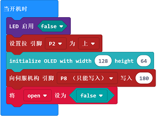
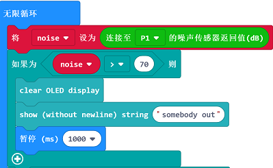
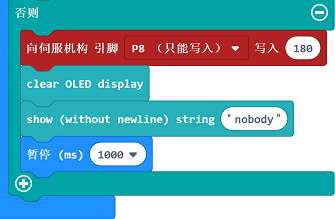

# 案例06 智能遥控开门器

## 目的
---

- 制作一个“智能遥控开门器”。

## 使用材料
---

- 1 X [智能家居套件（含主板）](https://item.taobao.com/item.htm?ft=t&id=609328225464)
- 剪刀，胶水，白纸和一些瓦楞纸板

## 背景知识
---

- 模拟噪音传感器电子积木是一种能够感受外界噪声信号的电子积木。它可用于感知和检测人的声音。

### 什么是“智能遥控开门器”

- 当你忙于自己的琐事，或者正在看的电视节目到了精彩片段，正在玩的游戏到了关键时刻，有朋友到访，你却无暇起身开门。制作一个智能遥控开门器，轻轻一按，将门打开。

### 模拟噪音传感器原理

- 当模拟噪音传感器电子积木接收到人的声音，发送数据到micro:bit，micro：bit通过OLDE显示器提醒主人，主人按下按钮，控制舵机将门打开。

## 结构场景搭建
---

- 准备剪刀，胶水和一些瓦楞纸板。
- 在纸板上贴好你准备好的小纸片，并将瓦楞纸板剪裁成需要的样子。

- 搭建成如图样式：

正面：

背面：

将元器件按如图摆放黏贴。

## 硬件连接图
---
扩展板P1口连接模拟噪音传感器电子积木
扩展板P2口连接碰撞电子积木
扩展板P8口连接180度舵机
micro:bit连接上电池盒

## 软件
---
[微软makecode](https://makecode.microbit.org/#)
 

## 编程
---
### 步骤 1

在MakeCode的代码抽屉中点击“高级”，查看更多代码选项。

为了给智慧家居套件编程，我们需要添加一个代码库。在代码抽屉底部找到“扩展”，并点击它。这时会弹出一个对话框。搜索“smarthome"，然后点击下载这个代码库。

注意：如果你得到一个提示说一些代码库因为不兼容的原因将被删除，你可

注意：如果你得到一个提示说一些代码库因为不兼容的原因将被删除，你可以根据提示继续操作，或者在项目菜单栏里面新建一个项目。

### 步骤 2

从“基本”中拖出一个“当开机时”积木块，然后拖入“LED 启用”积木块，设置为“false” 即关闭micro:bit的led显示；
点击“高级”，选择“引脚”，点击“更多”，拖出“设置拉”积木块，将P2口的电压设置为高电平，用于提供一个稳定的电压；
初始化OLED ，拖入initialize OLED积木块。
拖入“向伺服机构引脚” 积木块，将P8口设置为180，即将舵机的初始状态设置为关门状态。
最后将开门的变量设置为open，将开门这个变量的初始化值设置为不开门，即false。

### 步骤 3
初始化变量noise，用来保存接收到的噪声的数值；
在“无限循环”中，将P1口接收到的噪声的值，传输到noise变量中保存；
判断噪声值是否大于70分贝，当大于70分贝，说明有人来敲门了，在OLED显示器上显示“somebody out”；
拖入clear OLED display和show string 模块用来显示提示信息。

### 步骤 4
判断从碰撞传感器模块传来的值的变化，使用积木块“数字读取引脚”积木块读取碰撞传感器的值，即P2口的值的变化情况；
设置P2引脚的值为0，设置open变量的值为开门，即代码“将‘open’设为‘非false’”；
判断门是否应该被打开，open变量的值为true，使用“向伺服机构引脚”，将P8口的舵机的值设置为0；
然后设置暂停时间三秒钟，即开门时间为三秒钟。

### 步骤 5

当前面两个的判断不成立时，设置舵机状态为舵机为180度状态，然后OLED显示屏显示nobody，即无需开门。

### 程序

请参考程序连接：[https://makecode.microbit.org/_htqEPX30qYKL](https://makecode.microbit.org/_htqEPX30qYKL)

你也可以通过以下网页直接下载程序。

<iframe style="position:absolute;top:0;left:0;width:100%;height:100%;" src="https://makecode.microbit.org/#pub:_htqEPX30qYKL" frameborder="0" sandbox="allow-popups allow-forms allow-scripts allow-same-origin"></iframe>
  
---

## 结论
---

- 当检测到人，需要开门，OLED显示屏显示“somebody out”。
- 按下按钮，门自动打开3秒，三秒过后门自动关闭。
- 没有检测到人时，OLED显示屏显示“Nobody”。

## 思考
---

- 吹太久风扇，觉得有点冷？ 想要控制风扇自动开关，该如何设计编程呢？

## 常见问题
---

## 相关阅读  
---

