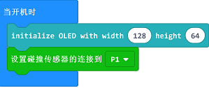
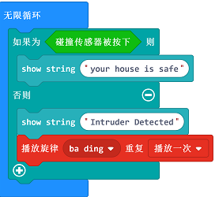

# 案例11 入侵检测系统

## 目的
---

- 制作一个入侵检测系统。

## 使用材料
---

- 1 X 智能家居套件
- 剪刀，胶水，白纸和一些瓦楞纸板

## 背景知识
---

- 蜂鸣器是利用振荡器发出声响的装置，可以根据用户定义的频率发出声响。

### 什么是入侵检测系统

- 我们将创造一个入侵检测系统。当有人开门的时候，它就会发出警报，而房屋的状态也会显示在OLED屏幕上。。

### 入侵检测系统原理

- 碰撞传感器模块接收碰撞信号，向micro:bit发送警报信号，micro:bit根据信号，使用蜂鸣器发出警报声，并在OLED显示器显示入侵信号。

## 结构场景搭建
---

- 准备剪刀，胶水和一些瓦楞纸板。
- 在纸板上贴好你准备好的小纸片，并将瓦楞纸板剪裁成需要的样子。

- 搭建成如图样式：

正面：

背面：

## 硬件连接图
---
将P1口与触碰模块连接
OLED显示器插入IIC接口中

## 软件
---
[微软makecode](https://makecode.microbit.org/#)
 

## 编程
---
### 步骤 1

在MakeCode的代码抽屉中点击“高级”，查看更多代码选项。

为了给智慧家居套件编程，我们需要添加一个代码库。在代码抽屉底部找到“扩展”，并点击它。这时会弹出一个对话框。搜索“smarthome"，然后点击下载这个代码库。

注意：如果你得到一个提示说一些代码库因为不兼容的原因将被删除，你可以根据提示继续操作，或者在项目菜单栏里面新建一个项目。

### 步骤 2

- 从Basic中拖出一个start积木块，然后将P1口设置为触碰检测口，用来监测触碰信号。

### 步骤 3

- 向“无限循环”中加入判断语句，时刻监测触碰模块的触碰情况。
当触碰模块保持被按下状态时，使用show string 积木块，在OLED显示屏上显示 “your treasure is safe”。
当有人打开房门，触碰模块被弹起，使用show string 积木块，在OLED显示屏上显示“your treasure is not safe”。
使用“播放旋律” 语句使蜂鸣器发出警报声。

### 程序

请参考程序连接：[https://makecode.microbit.org/_D6v8RH0dFYk1](https://makecode.microbit.org/_D6v8RH0dFYk1)

你也可以通过以下网页直接下载程序。

<iframe style="position:absolute;top:0;left:0;width:100%;height:100%;" src="https://makecode.microbit.org/#pub:_D6v8RH0dFYk1" frameborder="0" sandbox="allow-popups allow-forms allow-scripts allow-same-origin"></iframe>
  
---

## 结论
---

-当人打开房门，入侵检测系统调用蜂鸣器发出警报，OLED显示器显示有人入侵。

## 思考
---

- 借助家居智能套件中的光线传感器模块，你能想出什么样的创意？

## 常见问题
---

## 相关阅读  
---

