# 吸管机械手

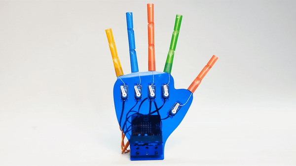

### 简介

我们的手是我们最经常使用的身体部位之一，它灵巧多变，纤细优美，有很多作品是模拟手做出的，同样这篇博客介绍的吸管机械手也是模拟手而做出的作品，希望大家喜欢和提出更多的创意。

我们做的吸管机械手是使用 [micro:bit](https://www.microbit.org) 和 [悟空扩展板](https://www.elecfreaks.com/learn-en/microbitExtensionModule/wukong.html) 来配合使用，控制180度舵机旋转，达到“手指”弯曲的效果。

### 悟空扩展板

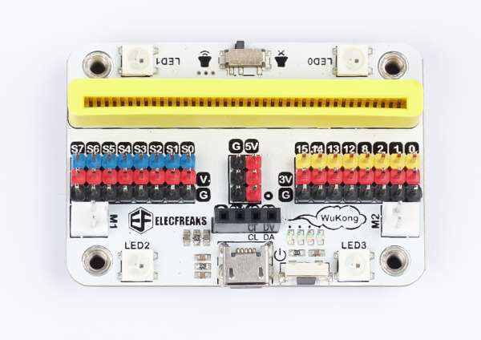

悟空 是一款基于 micro:bit 的高集成度多功能扩展板，它的大小与 micro:bit 相近，功能十分丰富，集成了蜂鸣器、舵机驱动、电机驱动等。 自带400mAh锂电池包，板载电源管理系统，支持快速充电，充满仅需20分钟，满负载运行时间可达到40分钟以上。 扩展板底座为乐高标准 7 X 5 方形积木块，完美接入乐高积木。

更多详细信息请参考恩孚科技[悟空扩展板](https://www.elecfreaks.com/learn-en/microbitExtensionModule/wukong.html)官方文档。

### 所需材料

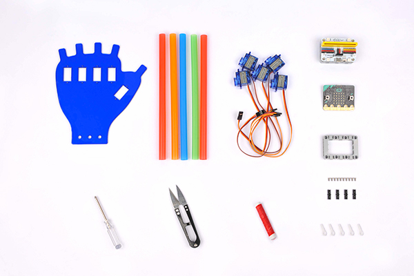

总材料清单

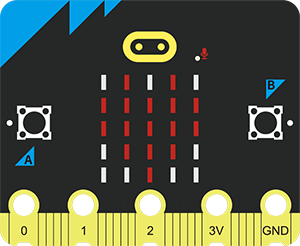

英国广播公司：micro:bit × 1

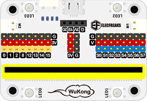

悟空扩展板 × 1

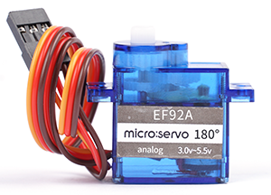

180度舵机 × 5

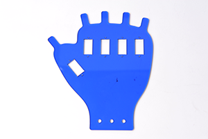

亚克力手板 × 1

吸管 × 5

### 硬件装配

#### 步骤一

将180度舵机出线的一端朝下分别安装到亚克力手板的长方形孔中，并用平头螺丝固定，如图所示：

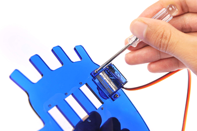

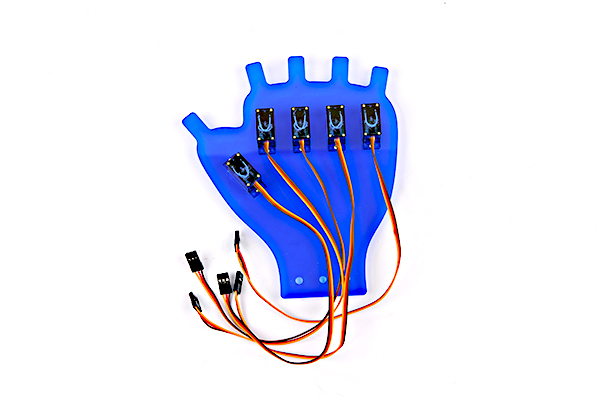

#### 步骤二

将装有方形框的悟空扩展板使用黑销固定到亚克力手板下面的乐高孔中并和180度舵机保持同一平面，将舵机引线插入悟空扩展板的舵机驱动接口，其中舵机引线棕色、红色、黄色分别对应舵机驱动接口的黑色、红色、蓝色插针，如图所示。可以根据需求自定义选择S0~S7的其中5个舵机驱动接口，在编程的时候选择对应的编号即可,本教程所使用的悟空扩展板接口如下表格所示：

| 接口 | 手指   |
| :--- | ------ |
| S0   | 大拇指 |
| S1   | 食指   |
| S3   | 中指   |
| S5   | 无名指 |
| S7   | 小拇指 |

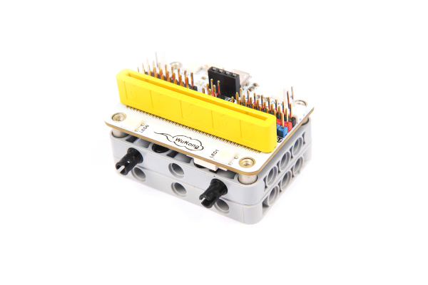

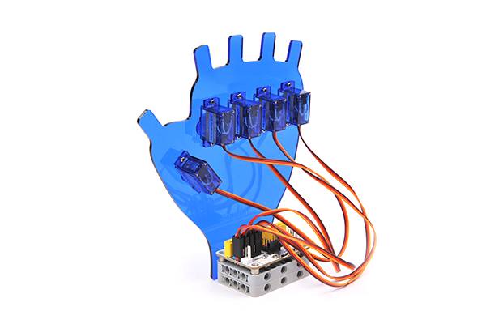

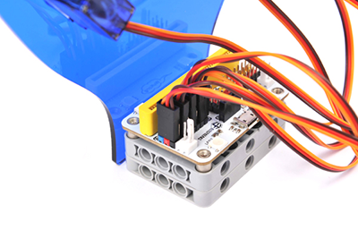

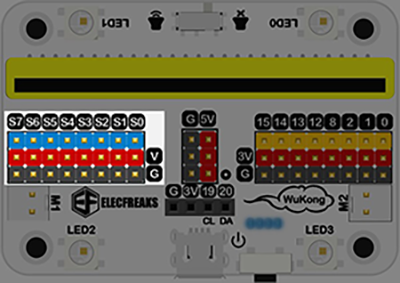

#### 步骤三

将 micro:bit 安装到悟空扩展板的插槽中。如图所示：

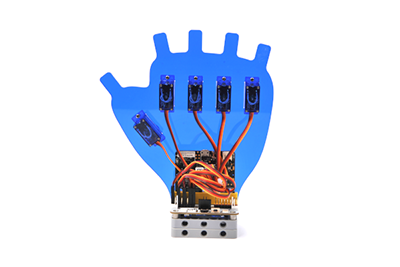

#### 步骤四

将5根平头吸管按如图形状剪切，并在上面一端从中间剪开5mm的裂口用于固定线头,如图所示：

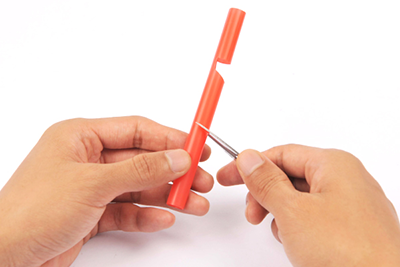

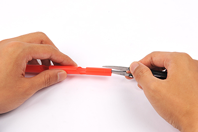

#### 步骤五

将棉线线缠绕单摆臂一端，然后将单摆臂从吸管上头经内部落下，同时捏住线头将吸管固定到亚克力手板的“手指”上，将单摆臂固定到舵机上，将棉线另一端打结固定到吸管最顶部的裂口处。如图所示：

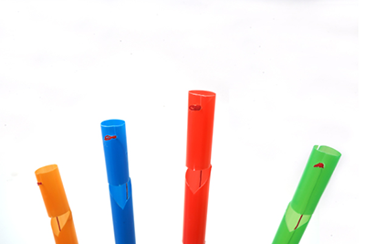

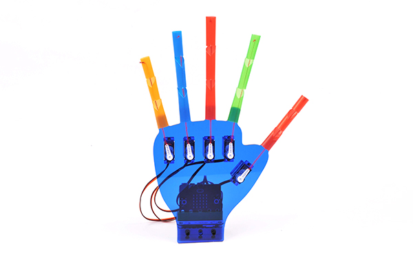

*注意：棉线一端是穿过单摆臂最上面的空洞并打结，另一端是打结形成小颗粒固定到吸管裂口处*

#### 步骤六

使用数据线连接电脑和 micro:bit，当micro:bit usb连接处右侧LED亮起黄色时，代表连接成功.

### 开始编程

micro:bit编程是使用 [Makecode](https://makecode.microbit.org) 编程平台，关于添加悟空扩展库和编程方法，参考如下步骤。

#### 步骤一

点击 New Project 新建文件，如图（1），填入文件名称，点击Greate，如图（2），进入编程界面。

#### 步骤二

进入到编程界面，点击界面中间的积木库 Advanced 按钮，如图（3），在下拉的菜单中点击 Extensions 按钮，如图（4），进入扩展库添加界面，输入“wukong”，点击搜索，点击左边wukong,如图（5），就可以将悟空的扩展库添加进来了,如图（6）。

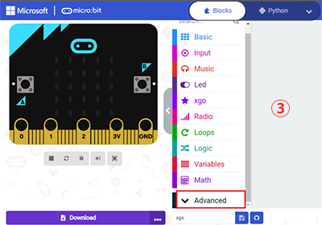

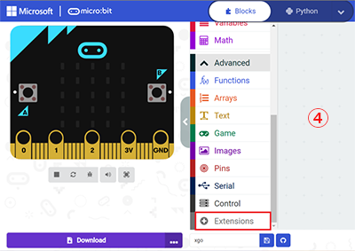

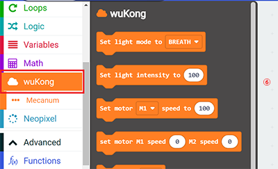

### 初始化

本教程所使用的初始化状态是：0度代表“手指”完全伸展，180度代表“手指”弯曲，所以，在开始正式编程之前要将舵机角度调整到0度。将单摆臂取下，使用 [Makecode](https://makecode.microbit.org) 编程如下程序代码，同时也可以直接下载下方程序。

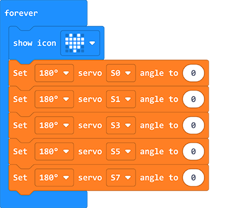

程序代码：

<iframe style="position:absolute;top:0;left:0;width:100%;height:100%;" src="https://makecode.microbit.org/#pub:_azoXDPMYE35F" frameborder="0" sandbox="allow-popups allow-forms allow-scripts allow-same-origin"></iframe>
 

将调整好后的舵机安装上单摆臂，就可以运行下方的程序代码，当然您也可以发挥自己的创造力，做出不同动作的“手舞”。

### 简单示例

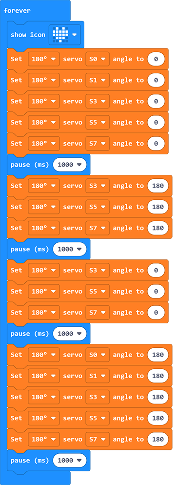

参考程序链接：[wukon](https://makecode.microbit.org/_H41XojcdMRo8)

同时，也可以从直接运行下方编程积木块：

<iframe style="position:absolute;top:0;left:0;width:100%;height:100%;" src="https://makecode.microbit.org/#pub:_H41XojcdMRo8" frameborder="0" sandbox="allow-popups allow-forms allow-scripts allow-same-origin"></iframe>
 

### 常见问题

吸管机械手使用的是180度舵机，所以控制舵机积木块的数值范围是：0~180。下载编程好的积木块代码到micro:bit后，打开悟空扩展板的电源开关，关于[悟空扩展板](https://www.elecfreaks.com/learn-en/microbitExtensionModule/wukong.html)的详细使用内容请参考其相关文档。
