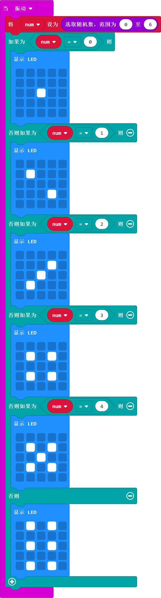

# 案例02：骰子

## 目的
---
- 使用watch kit手表套件完成可穿戴便携式骰子玩具。

## 使用材料
---

- 1 x Watch kit 手表套件

## 硬件连接图
---

如图所示，直接使用watch kit套件。

## 软件
---
[微软makecode](https://makecode.microbit.org/#)

## 编程
---
### 步骤 1

- 在input中拖出一个on shake积木块，在其中插入随机选取0-5之间的数赋值给`num`变量，用于随机投掷骰子。
- 之后插入判断积木块`if`和`else if`当随机数为`0`时，显示一个点，以此类推。

### 程序
- 请参考程序连接：[https://makecode.microbit.org/_fdYbizRa3VW4](https://makecode.microbit.org/_fdYbizRa3VW4)

- 你也可以通过以下网页直接下载程序。

<iframe style="position:absolute;top:0;left:0;width:100%;height:100%;" src="https://makecode.microbit.org/#pub:_fdYbizRa3VW4" frameborder="0" sandbox="allow-popups allow-forms allow-scripts allow-same-origin"></iframe>
  
---

## 结论
---

- 每次摇动，产生一个随机骰子数字。

## 思考
---

## 常见问题
---

## 相关阅读  
---

