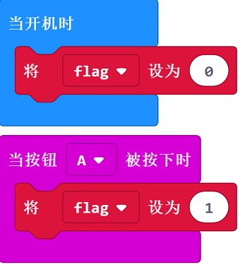
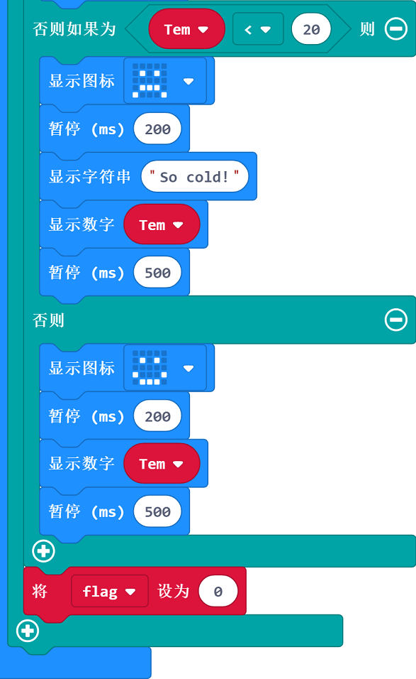

# 案例03：便携温度计

## 目的
---
- 使用watch kit手表套件完成可穿戴便携式温度计。

## 使用材料
---

- 1 x [Watch kit 手表套件(淘宝购买链接)](https://item.taobao.com/item.htm?ft=t&id=564916883947)

## 硬件连接图
---

如图所示，直接使用watch kit套件。

## 软件
---

[微软makecode](https://makecode.microbit.org/#)

## 编程
---
### 步骤 1

- 启动上电时将功能标签`flag`初始化为0，当按下按钮A时，功能标签设置为1，以进入功能。

### 步骤 2

- 设置一个永久循环，显示一个心，当功能标签为1时，进入功能，获取温度赋值给变量`Tem`。
- 如果温度`Tem`变量大于30(度)，显示一个伤心脸，提示So Hot，显示温度。延时0.5s。

### 步骤3

- 如果温度`Tem`变量小于20(度)，显示一个伤心脸，提示So cold，显示温度。延时0.5s。
- 如果温度在这两者之间，显示一个笑脸，显示温度，延时0.5s。
- 将功能标签`flag`设置为 0 退出功能。

### 程序
- 请参考程序连接：[https://makecode.microbit.org/_iHY0ReVrTJJX](https://makecode.microbit.org/_iHY0ReVrTJJX)

- 你也可以通过以下网页直接下载程序。

<iframe style="position:absolute;top:0;left:0;width:100%;height:100%;" src="https://makecode.microbit.org/#pub:_iHY0ReVrTJJX" frameborder="0" sandbox="allow-popups allow-forms allow-scripts allow-same-origin"></iframe>
  
---

## 结论
---

- 显示笑脸和温度。

## 思考
---

## 常见问题
---
问：有时候温度明显低于20度，显示的数值更高？

答：micro:bit获取的温度为主板芯片温度，并不是环境温度。当主板运行时间过久等芯片会明显发热。

## 相关阅读  
---

