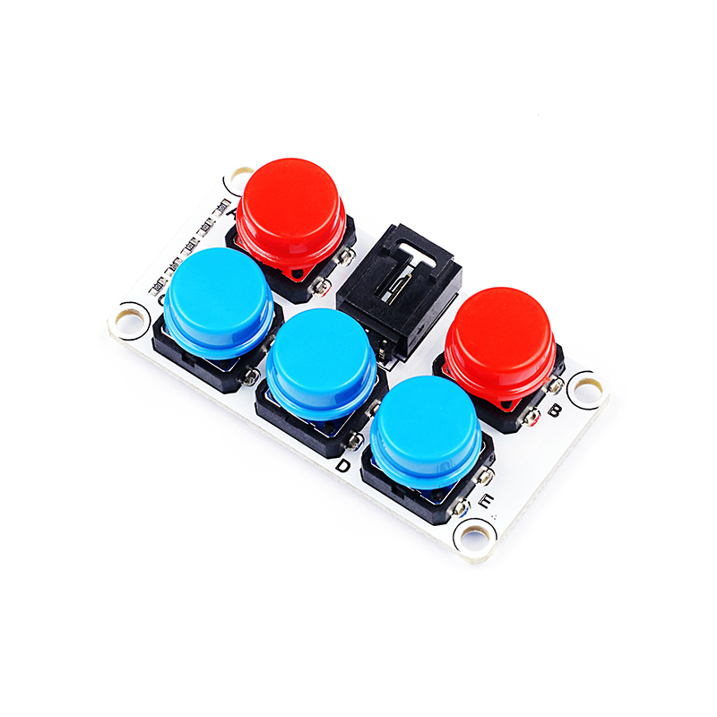
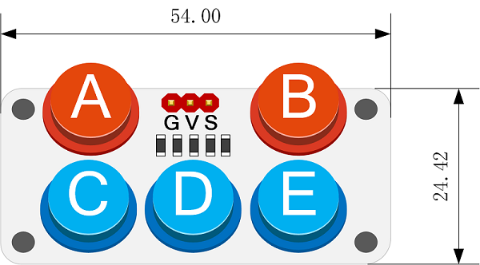
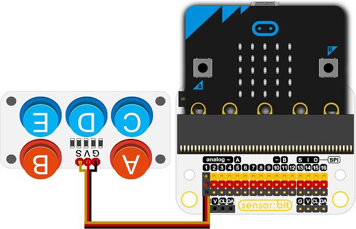
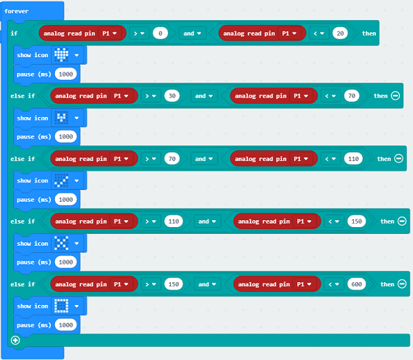

# ADKey键盘电子积木

## 简介
---
- 这个键盘使用模拟输入，使用一个IO口判断五个按键。
- 可以完成更多有趣的交互功能。

## 特性
---
- 三线端口设计，防止误插，易于使用。
- 3V电压支持micro:bit驱动

## 技术规格
---

项目 | 参数 
:-: | :-: 
SKU|EF04017
电源需求|3V-5V
接口类型|模拟
引脚定义|1-Signal 2-VCC 3-GND
响应|快速响应和高灵敏度
电路|简单的驱动电路
稳定性|稳定耐用

## 外形与定位尺寸
---
 

## 快速上手
---
### 所需器材及连接示意图
- 如图连接扩展板的P1口。

***以sensor:bit为例***

### 如图所示编写程序
- 模拟读取返回值，
- 当返回值为：0~20，则为A按钮按下，显示一颗大心。
- 以此类推。

### 参考程序

请参考程序连接：[https://makecode.microbit.org/_dqjTtAM5sfmy](https://makecode.microbit.org/_dqjTtAM5sfmy)

你也可以通过以下网页直接下载程序，下载完成后即可开始运行程序。

<iframe style="position:absolute;top:0;left:0;width:100%;height:100%;" src="https://makecode.microbit.org/#pub:_dqjTtAM5sfmy" frameborder="0" sandbox="allow-popups allow-forms allow-scripts allow-same-origin"></iframe>
  
---

### 结果
- 按压ADKeypad上面不同的按键，micro:bit点阵屏上显示不同的图形。

## 相关案例
---

## 技术文档
---
