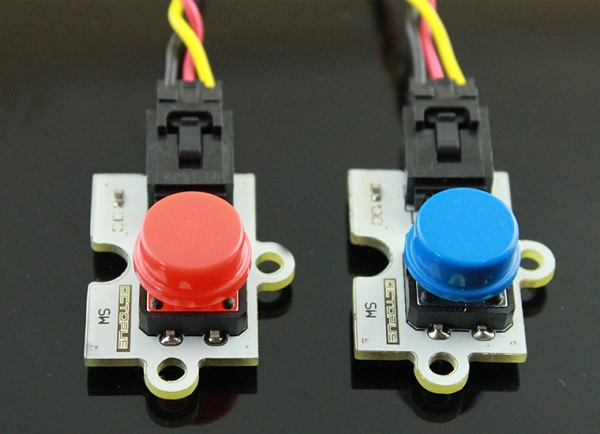
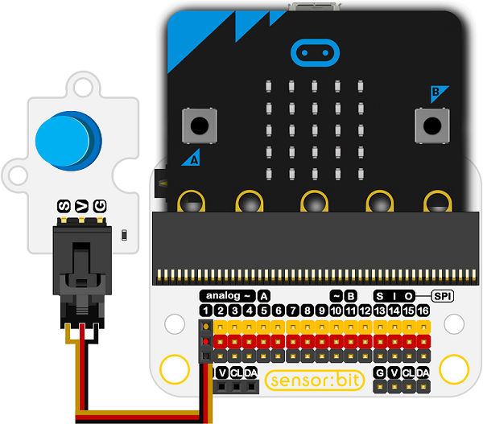

# 按钮电子积木

## 简介
---
 这是一个数字按钮传感器，可以检测您的按压动作，适合初学者使用。



## 特性
---
- 三线端口设计，防止误插，易于使用。
- 3V电压支持micro:bit驱动

## 技术规格
---

项目 | 参数 
:-: | :-: 
SKU|EF04034
电源需求|3V-5.5V
接口类型|数字
引脚定义|1-Signal 2-VCC 3-GND
响应|快速响应和高灵敏度
电路|简单的驱动电路
稳定性|稳定耐用

## 外形与定位尺寸
---


## 快速上手
---

### 所需器材及连接示意图
- 如图连接扩展板的P1口。

***以sensor:bit为例***



### 如图所示编写程序


### 参考程序

请参考程序连接：[https://makecode.microbit.org/_WhpgVrc8sPCM](https://makecode.microbit.org/_WhpgVrc8sPCM)

你也可以通过以下网页直接下载程序，下载完成后即可开始运行程序。

<div style="position:relative;height:0;padding-bottom:70%;overflow:hidden;"><iframe style="position:absolute;top:0;left:0;width:100%;height:100%;" src="https://makecode.microbit.org/#pub:_WhpgVrc8sPCM" frameborder="0" sandbox="allow-popups allow-forms allow-scripts allow-same-origin"></iframe></div>  
---

### 结果
- 当按钮被按下显示心形图案，当按钮被放开显示矩形图案

## python编程
---


### 步骤 1
下载压缩包并解压[Octopus_MicroPython-master](https://github.com/lionyhw/Octopus_MicroPython/archive/master.zip)
打开[Python editor](https://python.microbit.org/v/2.0)


为了给按钮模块编程，我们需要添加button.py。点击Load/Save，然后点击Show Files（1）下拉菜单，再点击Add file在本地找到下载并解压完成的Octopus_MicroPython-master文件夹，从中选择button.py添加进来。


### 步骤 2
### 参考程序
```
from microbit import *
from button import *

button = BUTTON(pin1)
while True:
    if button.Is_pressed():
        display.show(Image.HAPPY)
    else:
        display.clear()
```


### 结果
- 当按钮模块被按下时，micro:bit上的LED矩阵显示笑脸图案，否则不显示图案。

## 相关案例
---

## 技术文档
---
