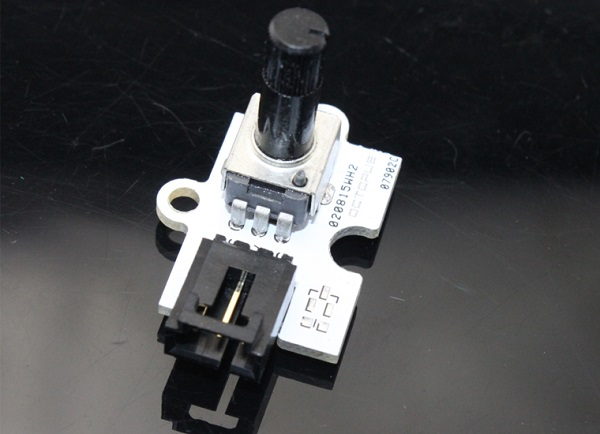
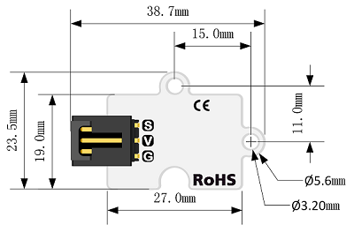
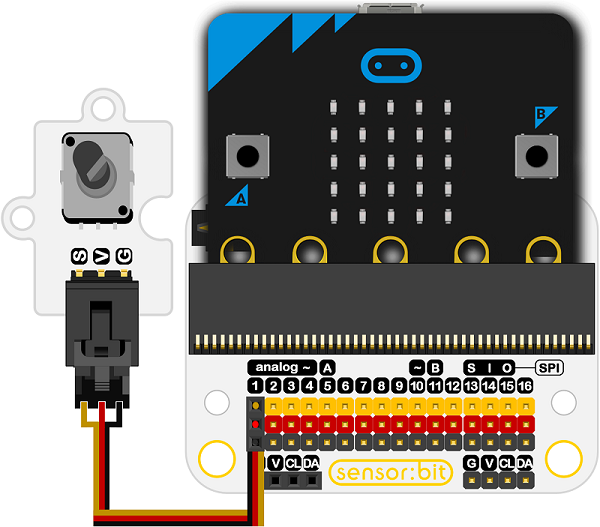

# 黑色长柄电位器电子积木

## 简介
---
Octopus模拟电位计旋转模块与micro:bit兼容，可以旋转300度。

## 特性
---
- 三线端口设计，防止误插，易于使用。
- 3V电压支持micro:bit驱动

## 技术规格
---

项目 | 参数
:-: | :-: 
SKU|04041
电源需求|3.3V~5.5V
接口类型|模拟
引脚定义|S-Sigal V-VCC G-GND
检测范围广|快速响应和高灵敏度
旋转角度|300度旋转传感器
尺寸|19x27mm

## 外形与定位尺寸
---

## 快速上手
---

### 所需器材及连接示意图
如图连接扩展板的P1口

***以sensor：bit为例***

 

### 参考程序
请参考程序连接：[https://makecode.microbit.org/_2hr1UMdcp0uj](https://makecode.microbit.org/_2hr1UMdcp0uj)

你也可以通过以下网页直接下载程序，下载完成后即可开始运行程序。

<iframe style="position:absolute;top:0;left:0;width:100%;height:100%;" src="https://makecode.microbit.org/#pub:_2hr1UMdcp0uj" frameborder="0" sandbox="allow-popups allow-forms allow-scripts allow-same-origin"></iframe>
  
---

### 结果
- 沿顺时针方向旋转模块上的按钮，然后逐渐打开micro:bit屏幕上的点阵屏。逆时针旋转按钮，led将逐一关闭。

## 相关案例
---

## 技术文档
---
