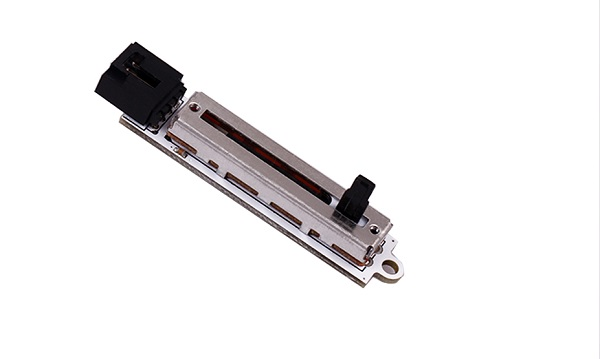
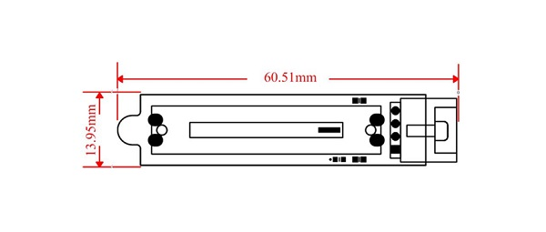
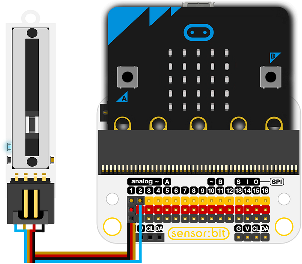
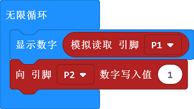

# 滑条电位器电子积木

## 简介
---
OCTOPUS电位器是一种简单的线性滑动电位器电子积木模块，可用于电阻分压器输出，HID控制面板，电子积木套件。

 

## 特性
---
- 三线端口设计，防止误插，易于使用。
- 3V电压支持micro:bit驱动

## 技术规格
---

项目 | 参数 
:-: | :-: 
SKU|EF04061
电源|3.3V~5V
变化长度|30毫米长的滑动长度
锥度|线性电阻锥度
尺寸|51mm X 13.95mm

## 外形与定位尺寸
---

 

## 快速上手
---

### 所需器材及连接示意图
- 如图所示将out口连接扩展板的P1口，将led口连接扩展板的P2口。

***以sensor：bit为例***

  

### 如图所示编写程序
1.使用micro:bit的点阵屏，显示读到的电位器的数值。

2.向电位器写入数值1，,将电位器上的led灯点亮

 

### 参考程序
---
请参考程序连接：[https://makecode.microbit.org/_azRa44aXt3Kh](https://makecode.microbit.org/_azRa44aXt3Kh)

你也可以通过以下网页直接下载程序，下载完成后即可开始运行程序。

<iframe style="position:absolute;top:0;left:0;width:100%;height:100%;" src="https://makecode.microbit.org/#pub:_azRa44aXt3Kh" frameborder="0" sandbox="allow-popups allow-forms allow-scripts allow-same-origin"></iframe>
  
---

### 结果
---
- 随着电位器的阻值被改变，micro:bit的点阵屏上显示出对应的0-1023区间内的阻值，
- 同时滑动条上的led灯被点亮。

## 相关案例
---

## 技术文档
---
