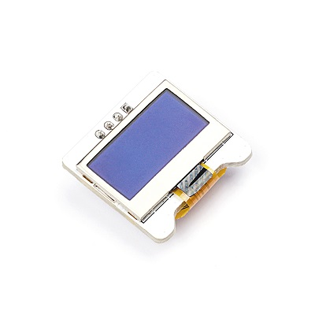
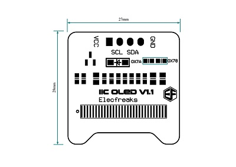
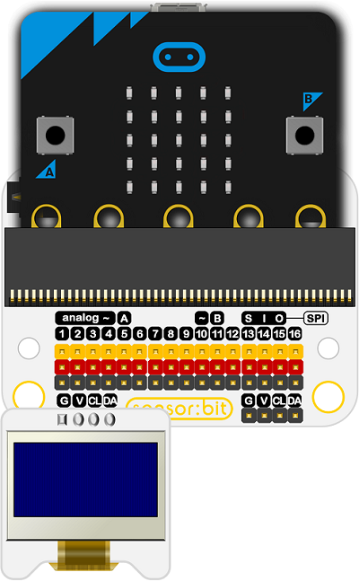
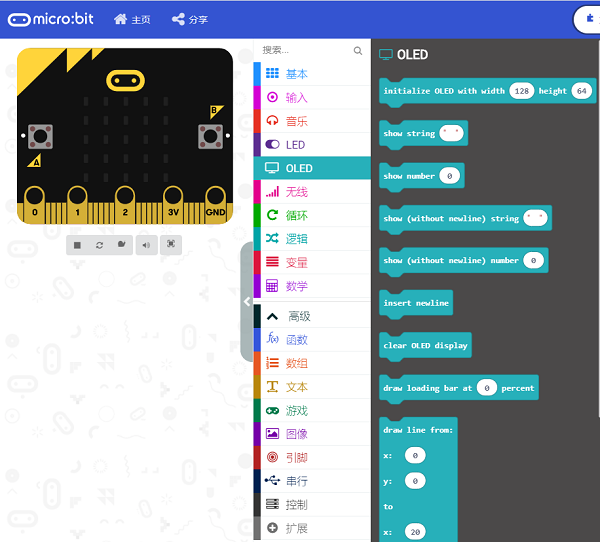
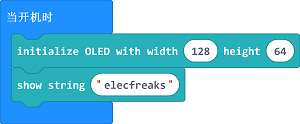

# OLED显示屏

## 简介
---
- 这是一款OLED显示屏，用于打印在屏幕想要显示的数据信息（不支持显示中文）。
    
 

## 特性
---
- 这个显示器是迷你型的oled显示器，直径只有1英寸，借助OLED显示屏的高对比度达到极高的清晰度。
- 该显示器由128x64个白色OLED像素组成，每个像素由控制器芯片打开或关闭。     
- 显示器很小巧，OLED显示器的高对比度提供了它极强的可读性。 该显示器由128×64个单独的白色OLED像素构成，每个像素由控制器芯片打开或关闭。
- 显示器是一款无需背光自发光的模块。这降低了运行OLED所需的功率，这也是显示器具有如此高对比度的原因;我们真的很喜欢这款微型显示器的清晰度！
- 设计时板载了稳压器和内置升压转换器完全支持5V供电。直接连接到3V或5V微控制器比以往任何时候都更容易，而无需任何类型的电平转换器！

## 技术规格
---

项目 | 参数 
:-: | :-: 
SKU|EF03155
OLED自发光|无背光
屏幕尺寸 | 0.96
分辨率|128×64
颜色|蓝色
通讯方式|IIC
功耗|超低功耗
工作温度|-20-70℃
工作电压|3.3-5V
模块尺寸|27mm * 28mm

## 外形与定位尺寸
---

 

## 快速上手
---

### 连接示意图
- CL引脚连接CL;SA引脚连接DA;V引脚连接V;G引脚连接G

***以sensor:bit为例***

 

### 添加Package
- 在MakeCode的代码抽屉中点击Advanced，查看更多代码选项。

 

- 点击“Extensions”，在弹出的对话框中搜索“oled"，下载oled-ssd1306代码库。
 
 

 

### 如图所示编写程序
- 初始化OLED屏幕为64*128像素。
- 显示一行字符:“elecfreaks”

 

### 参考程序
---
请参考程序连接：[https://makecode.microbit.org/_D9AVPTPEigh9](https://makecode.microbit.org/_D9AVPTPEigh9)

你也可以通过以下网页直接下载程序，下载完成后即可开始运行程序。

<iframe style="position:absolute;top:0;left:0;width:100%;height:100%;" src="https://makecode.microbit.org/#pub:_D9AVPTPEigh9" frameborder="0" sandbox="allow-popups allow-forms allow-scripts allow-same-origin"></iframe>
  
---

### 结果
- 显示器上显示了一个elecfreaks的字样。

 

## 相关案例
---

## 技术文档
---
[Datasheet](https://elecfreaks.com/estore/download/EF03155-Datasheet)
