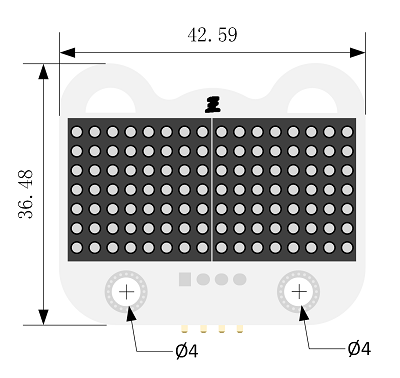
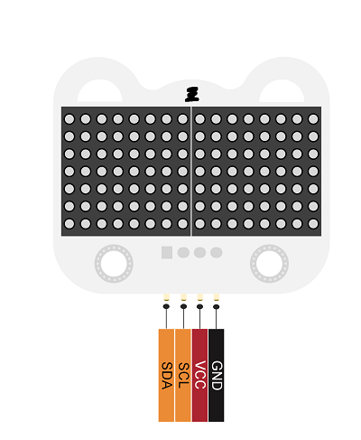
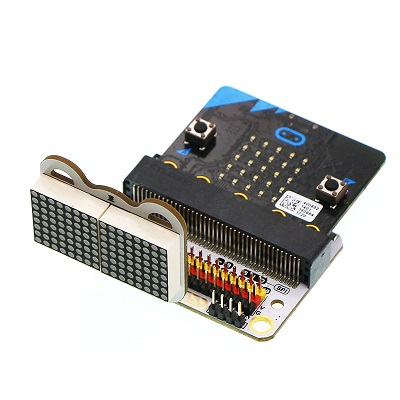

# 8 x 16点阵屏电子积木

## 简介
---

8x16 matrix module是一款可以显示数字、常用字母及符号的8x16点阵屏幕，支持屏幕滚动。采用IIC 总线协议控制，连接简单，控制方便。

## 特性 
---

- 采用高亮度、低功耗、工作可靠的点阵模块。
- 独具个性的外形及丝印设计。
- 连接简单、控制方便的IIC通讯方式。
- 3硬件地址位可自定义。

## 参数
---
项目 | 参数 
:-: | :-: 
品名|8x16 matrix module
版本号|V1.2
SKU|EF03418
工作电压|DC 3-5V
通讯方式|IIC接口
尺寸|37 x 43mm
净重|11.6g

### 外型与定位尺寸  

## 引脚接口框图

  

## 主要功能模块介绍  
---  

### 8x16点阵屏  

  
每一颗LED均可独立开启与关闭，常用来显示数字、常用字母及符号。

### I2C通讯接口 

  
通过I2C通讯方式与单片机进行通讯。

## 快速上手  
---  

### 硬件连接  

将micro:bit主板插入sensor:bit主板，将8x16 matrix module插入sensor:bit上的IIC通讯接口排母。

### 软件编程  

打开makecode，编写程序让8x16led点阵显示刷屏效果。
程序代码链接：[https://makecode.microbit.org/_FsFWvpXP4gsm](https://makecode.microbit.org/_FsFWvpXP4gsm)

你也能通过下列窗口直接下载代码

<iframe style="position:absolute;top:0;left:0;width:100%;height:100%;" src="https://makecode.microbit.org/#pub:_FsFWvpXP4gsm" frameborder="0" sandbox="allow-popups allow-forms allow-scripts allow-same-origin"></iframe>

### 结果  

8x16 matrix module先从上往下刷屏显示，然后从左往右刷屏显示。

## 常见问题
