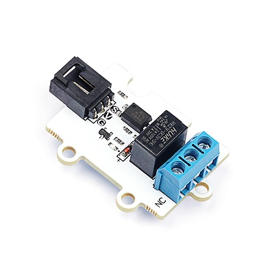
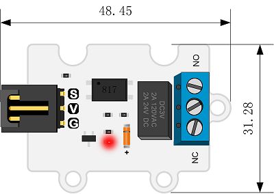
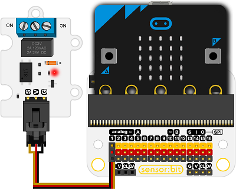
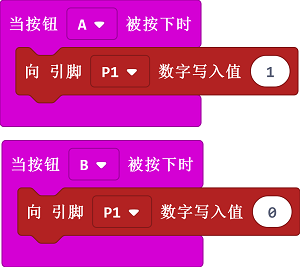

# 5V 继电器电子积木

## 简介
---
OCTOPUS 1Channel Relay是一款单继电器电子积木块。

 

## 特性
---
- 三线端口设计，防止误插，易于使用。
- 3V电压支持micro:bit驱动

## 技术规格
---

项目 | 参数 
:-: | :-: 
SKU|EF04026
继电器电源电压|3V-5.5V
接触器控制|采用光隔离电路
驱动电路|晶体管驱动电路，控制引脚高阻抗
大电流继电器|DC 24V 2A，AC 120V 2A
PCB定位孔|3mm标准定位孔

## 外形与定位尺寸
---

 

## 快速上手
---

### 所需器材及连接示意图
---
- 如图连接扩展板的P1口。

***以sensor:bit为例***

 

### 如图所示编写程序
---

 

### 参考程序
---

[https://makecode.microbit.org/_5fRVFCVFUJmE](https://makecode.microbit.org/_5fRVFCVFUJmE)
请参考程序连接：

你也可以通过以下网页直接下载程序，下载完成后即可开始运行程序。

<iframe style="position:absolute;top:0;left:0;width:100%;height:100%;" src="https://makecode.microbit.org/#pub:_5fRVFCVFUJmE" frameborder="0" sandbox="allow-popups allow-forms allow-scripts allow-same-origin"></iframe>
  
---

### 结果
- 按下micro：bit的A，B键可控制继电器的通断。

## 相关案例
---

## 技术文档
---

