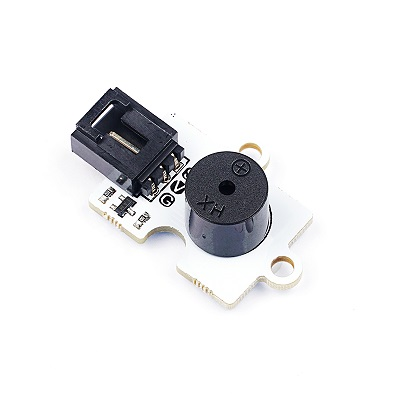
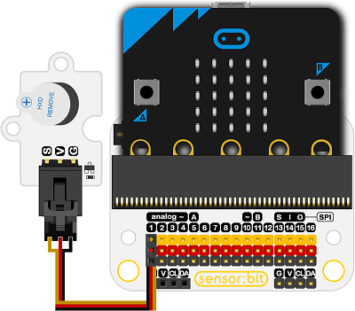

# 有源蜂鸣器

## 简介
---
Octopus有源蜂鸣器Brick基于有源蜂鸣器，无法通过PWM控制音量。音量恒定。

 

## 特性
---
- 三线端口防止错误插拔，易于使用。

## 技术规格
---

项目 | 参数 
:-: | :-: 
SKU|EF04030
电源需求|3V-5V
接口类型|模拟
引脚定义|S-Sigal V-VCC G-GND
检测范围|检测范围广
响应|快速响应
灵敏度|高灵敏度
电路|简单的驱动电路
寿命|稳定耐用
尺寸|19x27mm

## 外形与定位尺寸
---

## 快速上手
---
### 所需器材及连接示意图
连接扩展板的P1口

***以sensor:bit为例***

### 如图所示编写程序

### 参考程序

请参考程序连接：[https://makecode.microbit.org/_J82V5PgzghKR](https://makecode.microbit.org/_J82V5PgzghKR)

你也可以通过以下网页直接下载程序，下载完成后即可开始运行程序。

<iframe style="position:absolute;top:0;left:0;width:100%;height:100%;" src="https://makecode.microbit.org/#pub:_J82V5PgzghKR" frameborder="0" sandbox="allow-popups allow-forms allow-scripts allow-same-origin"></iframe>
  
---

### 结果
- 蜂鸣器持续不断的发出蜂鸣声。

## 相关案例
---

## 技术文档
---
