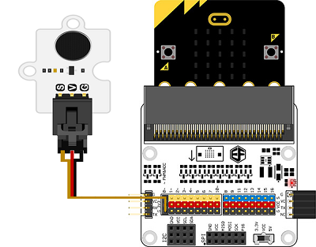

# 无源蜂鸣器

## 简介
---
- Octopus Passive蜂鸣器Brick基于无源蜂鸣器，它可以通过PWM控制音量.

 

## 特性
---
- 三线端口防止错误插拔，易于使用。
- 3V电压支持micro:bit驱动

## 技术规格
---

项目 | 参数 
:-: | :-: 
SKU|EF04031
电源需求|3V-5.5V
接口类型|模拟
引脚定义|1-Signal 2-VCC 3-GND
响应|快速响应和高灵敏度
电路|简单的驱动电路
稳定性|稳定耐用

## 外形与定位尺寸
---

## 快速上手
---

### 所需器材及连接示意图
- 如图连接扩展板的P0口。

***以sensor:bit为例***

 

### 如图所示编写程序
---
- 上电之后播放一段音乐。

 

### 参考程序

请参考程序连接：[https://makecode.microbit.org/_Yew55FJateYP](https://makecode.microbit.org/_Yew55FJateYP)

你也可以通过以下网页直接下载程序，下载完成后即可开始运行程序。

<iframe style="position:absolute;top:0;left:0;width:100%;height:100%;" src="https://makecode.microbit.org/#pub:_Yew55FJateYP" frameborder="0" sandbox="allow-popups allow-forms allow-scripts allow-same-origin"></iframe>
  
---

### 结果
- 程序上电以后，蜂鸣器播放一段音乐。

## 相关案例
---

## 技术文档
---
