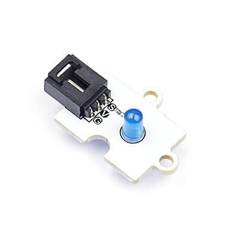
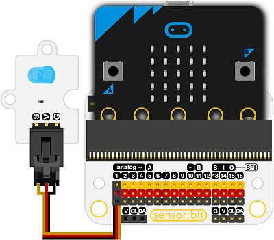
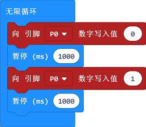

# 蓝色圆形LED

## 简介
---
- Octopus 5mmLED灯砖，可以搭配micro:bit调节各种场景的灯光效果。

 

## 特性
---
- 三线端口设计，防止误插，易于使用。

## 技术规格
---

项目 | 参数 
:-: | :-: 
功耗|超低功耗
SKU|04036
工作温度|-20-70℃
工作电压|3.3-5V
## 外形与定位尺寸
---

 

## 快速上手
---

### 所需器材及连接示意图
- 如下图所示，连接扩展板的P1口。

***以sensor：bit为例***

 
### 添加Package

### 如图所示编写程序
- 循环的给P1口写入0，1。

### 参考程序

请参考程序连接：[https://makecode.microbit.org/_J82V5PgzghKR](https://makecode.microbit.org/_J82V5PgzghKR)

你也可以通过以下网页直接下载程序，下载完成后即可开始运行程序。

<iframe style="position:absolute;top:0;left:0;width:100%;height:100%;" src="https://makecode.microbit.org/#pub:_J82V5PgzghKR" frameborder="0" sandbox="allow-popups allow-forms allow-scripts allow-same-origin"></iframe>
  
---

### 结果
- 程序运行后，led一秒钟点亮一次。

## 相关案例
---

## 技术文档
---
