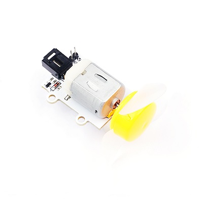
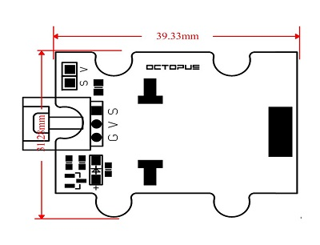

# 130带扇叶电机电子积木

## 简介
---
OCTOPUS Motor Brick是一种简单的电子积木式风扇电机驱动模块

 

## 特性
---
- 三线端口设计，防止误插，易于使用。

## 技术规格
---
项目 | 参数 
:-: | :-: 
电源|3.3V-5V
N-MOS| IRLML2502TRPBF具有高电流驱动能力
低功率风扇电机|工作电流120mA
工作温度|-25~85℃
尺寸|39.33mm×31.28mm

## 外形与定位尺寸
---

 

## 快速上手
---
### 所需器材及连接示意图

- 如图连接扩展板的P16口

***以octupus：bit为例***

 

### 添加Package
### 如图所示编写程序
按A键向P16口写入1，按B键向P16口写入0

 

### 参考程序
请参考程序连接：[https://makecode.microbit.org/_fUURco9Rj8mH](https://makecode.microbit.org/_fUURco9Rj8mH)

你也可以通过以下网页直接下载程序，下载完成后即可开始运行程序。

<iframe style="position:absolute;top:0;left:0;width:100%;height:100%;" src="https://makecode.microbit.org/#pub:_fUURco9Rj8mH" frameborder="0" sandbox="allow-popups allow-forms allow-scripts allow-same-origin"></iframe>
  
---

### 结果

- 当按下A键时电机旋转，当按下B键时电机停止旋转。

## 相关案例
---

## 技术文档
---
