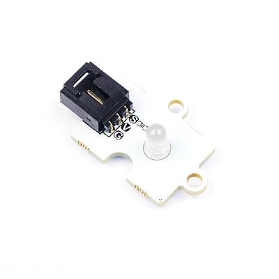

# 白色圆形LED

## 简介
---
Octopus 5mmLED灯模块，能和micro:bit/Arduino扩展板搭配，实现调整环境光的功能。

 

## 特性
---
- 三线端口防止错误插拔，易于使用。

## 技术规格
---

项目 | 参数 
:-: | :-: 
SKU|EF04065
电压|3.3V~5V
重量|5克

## 外形与定位尺寸
---
 

## 快速上手
---
### 所需器材及连接示意图
- 连接扩展板的P0口

***以octupus：bit为例***

### 添加Package

### 如图所示编写程序
向P0引脚中每隔一秒钟写入1或0

### 参考程序

请参考程序连接：[https://makecode.microbit.org/_J82V5PgzghKR](https://makecode.microbit.org/_J82V5PgzghKR)

你也可以通过以下网页直接下载程序，下载完成后即可开始运行程序。

<iframe style="position:absolute;top:0;left:0;width:100%;height:100%;" src="https://makecode.microbit.org/#pub:_J82V5PgzghKR" frameborder="0" sandbox="allow-popups allow-forms allow-scripts allow-same-origin"></iframe>
  
---

### 结果
- led灯一秒钟闪一次

## 相关案例
---

## 技术文档
---
